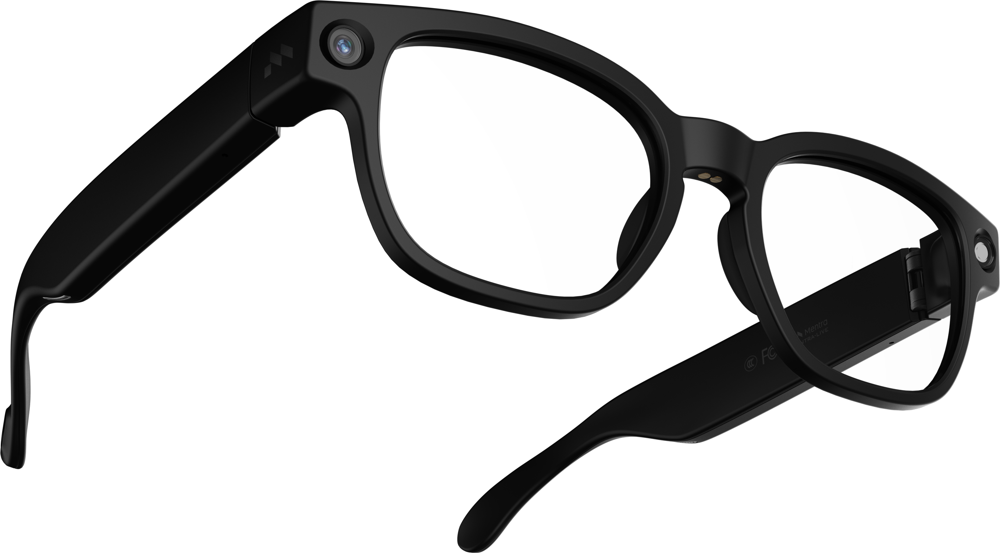
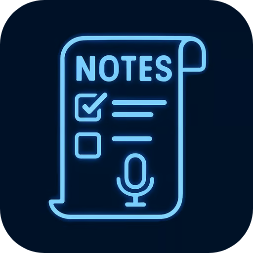
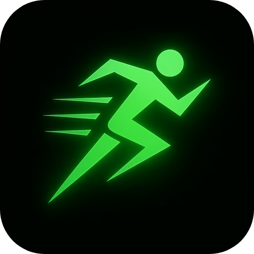
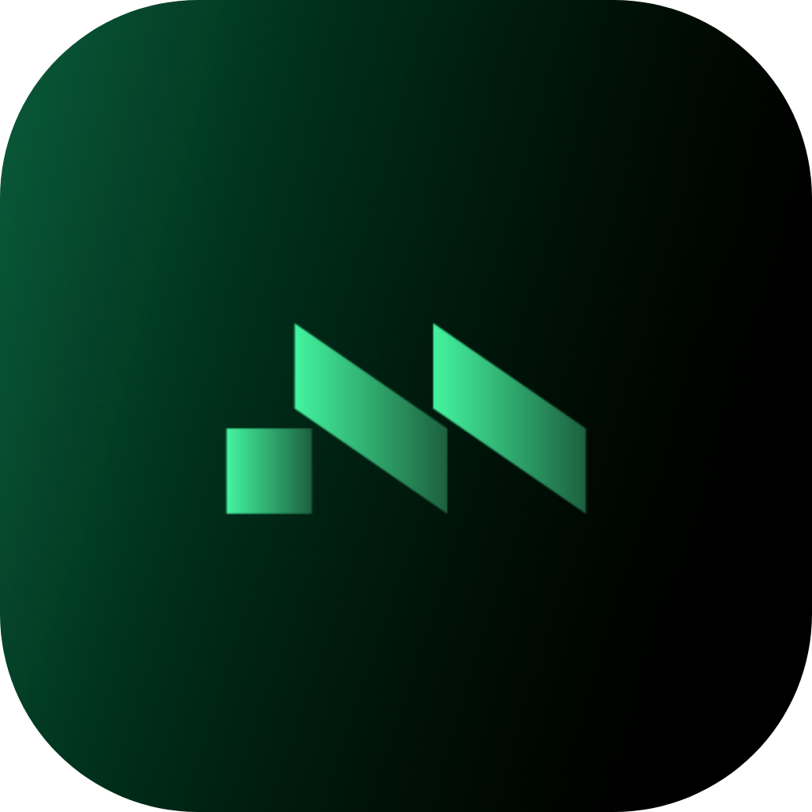

  

    
    
    
  

  <h1>MentraOS</h1>
  <h3>The open source operating system for smart glasses</h3>
  
  

    <a href="https://mentra.glass">Website</a> •
    <a href="https://docs.mentra.glass">Documentation</a> •
    <a href="https://console.mentra.glass">Developer Console</a> •
    <a href="https://apps.mentra.glass">Mentra Store</a>
  

  

    
    
    
    
    
  

  
  

## Supported Smart Glasses

Works with Even Realities G1, Mentra Mach 1, Mentra Live. See [smart glasses compatibility list here](./glasses-compatibility.md).

## Apps on Mentra Store

The Mentra Store already has a ton of useful apps that real users are running everyday. Here are some apps already published by developers on the Mentra Store:

  <table border="0" style="border: none;">
    <tr>
      <td align="center" style="padding: 15px;">
        <a href="https://apps.mentra.glass/package/com.augmentos.livecaptions" style="text-decoration: none; color: inherit;">
          
           <b>Live Captions</b>
        </a>
      </td>
      <td align="center" style="padding: 15px;">
        <a href="https://apps.mentra.glass/package/com.mentra.link" style="text-decoration: none; color: inherit;">
          
           <b>Link</b>
        </a>
      </td>
      <td align="center" style="padding: 15px;">
        <a href="https://apps.mentra.glass/package/com.mentra.merge" style="text-decoration: none; color: inherit;">
          
           <b>Merge</b>
        </a>
      </td>
      <td align="center" style="padding: 15px;">
        <a href="https://apps.mentra.glass/package/com.mentra.notes" style="text-decoration: none; color: inherit;">
          
           <b>Notes</b>
        </a>
      </td>
    </tr>
    <tr>
      <td align="center" style="padding: 15px;">
        <a href="https://apps.mentra.glass/package/com.mentra.calendarreminder" style="text-decoration: none; color: inherit;">
          
           <b>Calendar</b>
        </a>
      </td>
      <td align="center" style="padding: 15px;">
        <a href="https://apps.mentra.glass/package/com.mentra.dash" style="text-decoration: none; color: inherit;">
          
           <b>Dash</b>
        </a>
      </td>
      <td align="center" style="padding: 15px;">
        <a href="https://apps.mentra.glass/package/com.mentra.translation" style="text-decoration: none; color: inherit;">
          
           <b>Translation</b>
        </a>
      </td>
      <td align="center" style="padding: 15px;">
        <a href="https://apps.mentra.glass" style="text-decoration: none; color: inherit;">
          
           <b>→ Browse All Apps</b>
        </a>
      </td>
    </tr>
  </table>

## Write Once, Run on Any Smart Glasses

**MentraOS is how developers build smart glasses apps.** We handle the pairing, connection, data streaming, and cross-compatibility, so you can focus on creating amazing apps. Every component is 100% open source (MIT license).

### Why Build with MentraOS?

- **Cross Compatibility**: Your app runs on any pair of smart glasses
- **Speed**: TypeScript SDK means you're making apps in minutes, not months
- **Control**: Access smart glasses I/O - displays, microphones, cameras, speakers
- **Distribution**: Get your app in front of everyone using smart glasses

## MentraOS Community

The MentraOS Community is a group of developers, companies, and users dedicated to ensuring the next personal computer is open, cross-compatible, and user-controlled. That's why we're building MentraOS.

To get involved, join the [MentraOS Community Discord server](https://mentra.glass/discord).

## Contact

Have questions or ideas? We'd love to hear from you!

- **Email**: [team@mentra.glass](mailto:team@mentra.glass)
- **Discord**: [Join our community](http://mentra.glass/discord)
- **Twitter**: [Follow @mentralabs](https://x.com/mentralabs)

## Contributing

MentraOS is made by a community and we welcome PRs. Here's the Contributors Guide: [docs.mentra.glass/contributing](https://docs.mentra.glass/contributing)

## License

MIT License Copyright 2025 MentraOS Community

---

   
  
  <h3>© 2025 Mentra Labs</h3>

