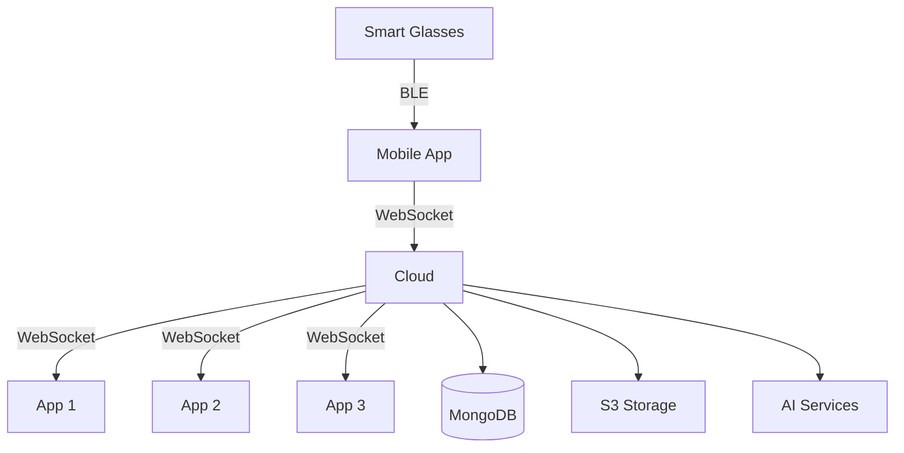

# MentraOS Cloud

MentraOS Cloud is the backend infrastructure for MentraOS - an open-source operating system for smart glasses. It orchestrates communication between glasses, mobile apps, and third-party applications, enabling real-time augmented reality experiences.

## Quick Start

### Prerequisites

- [Docker](https://www.docker.com/get-started)
- [Bun](https://bun.sh/docs/installation)
- [Node.js](https://nodejs.org/) 18+ (for some tools)

### Development Setup

1. **Clone the repository:**

   ```bash
   git clone https://github.com/Mentra-Community/MentraOS.git
   cd MentraOS/cloud
   ```

2. **Start development environment:**

   ```bash
   bun install

   bun run dev
   ```

3. **View logs:**

   ```bash
   # All logs
   bun run logs

   # Cloud service logs
   bun run logs:cloud

   # Specific service logs
   bun run logs:service <service-name>
   ```

### Useful Commands

- **Rebuild Docker containers:**

  ```bash
  bun run dev:rebuild
  ```

- **Stop all services:**

  ```bash
  bun run dev:stop
  ```

- **Clean environment (remove volumes and prune):**

  ```bash
  bun run dev:clean
  ```

- **Build shared packages:**

  ```bash
  bun run build
  ```

- **Run linting:**

  ```bash
  cd packages/cloud && bun run lint
  ```

- **Run tests:**
  ```bash
  bun run test
  ```

## 📚 Documentation

### [View Full Documentation → https://cloud-docs.mentra.glass/](https://cloud-docs.mentra.glass/)

Our comprehensive documentation includes:

- 🏗️ **Architecture Overview** - Understand the system design
- 🔧 **Local Development Setup** - Get running locally with ngrok
- 📡 **WebSocket APIs** - Glasses and app connection protocols
- 🗄️ **Data Models** - MongoDB schemas and relationships
- 📦 **SDK Reference** - Build apps with our TypeScript SDK
- 🚀 **Deployment Guide** - Production deployment instructions

## Project Structure

```
cloud/
├── packages/
│   ├── cloud/          # Main cloud service
│   └── sdk/            # TypeScript SDK for apps
├── store/              # App Store web interface
├── developer-portal/   # Developer console web app
└── docs/               # Documentation (Mintlify)
```

## Key Features

- **Real-time Communication**: WebSocket-based architecture for low-latency glasses ↔ cloud ↔ app communication
- **Multi-Provider Transcription**: Supports Azure Speech, Soniox, and Deepgram for speech-to-text
- **Flexible AI Integration**: Compatible with OpenAI, Azure OpenAI, and Anthropic for LLM features
- **App Ecosystem**: SDK and APIs for third-party developers to build apps
- **Display Management**: Intelligent throttling and prioritization for glasses displays
- **Session Management**: Robust user session handling with automatic reconnection

## Development Workflow

1. **Environment Setup:**
   - Copy `.env.example` to `.env` and configure services
   - For internal team: Get pre-configured `.env` from Slack
   - For contributors: See [documentation](https://cloud-docs.mentra.glass/development/local-setup) for service setup

2. **Work on Cloud Core:**

   ```bash
   # Start development environment
   bun run dev

   # View logs
   bun run logs:cloud

   # Run tests
   bun test
   ```

3. **Build Apps:**

   ```bash
   # Navigate to app directory
   cd packages/apps/your-app

   # Start development
   bun run dev

   # See SDK documentation for app development
   ```

4. **Run Web Portals:**

   ```bash
   # App Store
   cd store/web && bun run dev

   # Developer Portal
   cd developer-portal && bun run dev
   ```

## Contributing

We welcome contributions! Please:

1. Fork the repository
2. Create a feature branch (`git checkout -b feature/amazing-feature`)
3. Commit your changes (`git commit -m 'Add amazing feature'`)
4. Push to the branch (`git push origin feature/amazing-feature`)
5. Open a Pull Request

See our [Contributing Guide](../CONTRIBUTING.md) for more details.

## Architecture Overview



## Support

- 💬 [Discord Community](https://discord.gg/5ukNvkEAqT)
- 📖 [Documentation](https://cloud-docs.mentra.glass/)
- 🐛 [Issue Tracker](https://github.com/Mentra-Community/MentraOS/issues)
- 📧 Email: support@augmentos.com

## License

This project is licensed under the MIT License - see the [LICENSE](../LICENSE) file for details.
