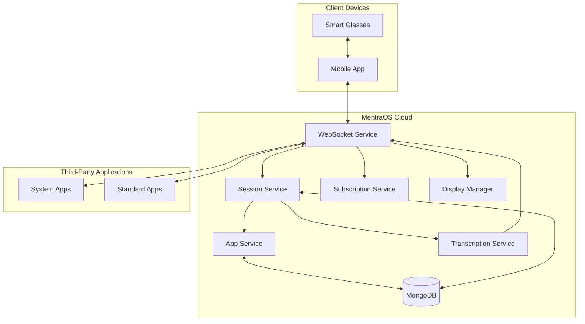
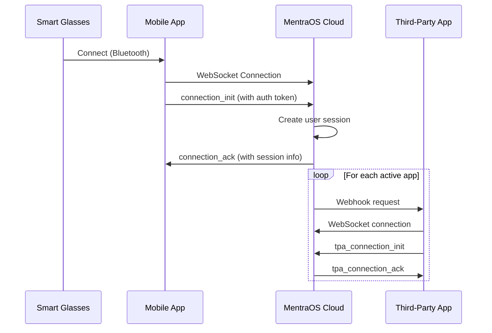
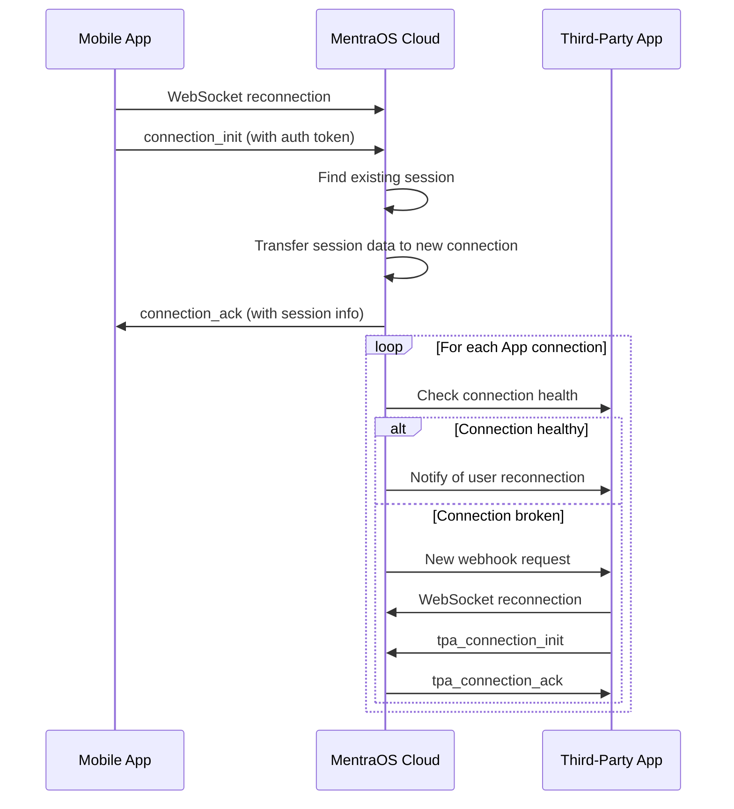
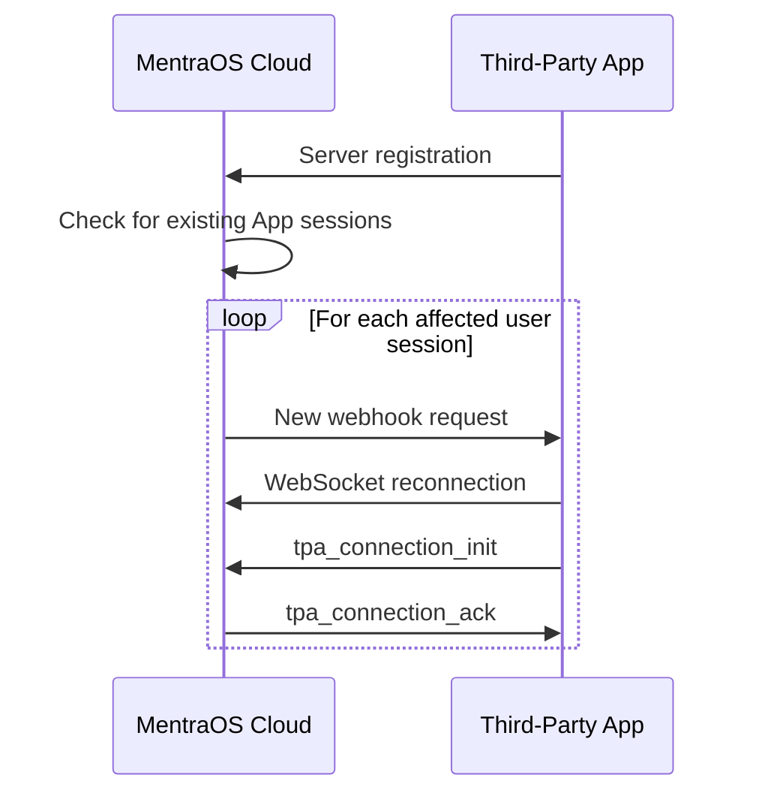

# MentraOS Cloud System Architecture

**Author:** Isaiah Ballah (github: isaiahb)
**Date:** March 25, 2025
**Version:** 2.0

## 1. Introduction

MentraOS is a cloud-based operating system for smart glasses that manages the communication, data processing, and application lifecycle for an ecosystem of Third-Party Applications (Apps). This document provides a comprehensive overview of the system architecture, focusing on the cloud components, communication protocols, and resilience mechanisms.

## 2. System Overview



## 3. Key Components

### 3.1 Cloud Services

#### WebSocket Service
The central communication hub that:
- Manages real-time connections with glasses clients
- Handles connections with Apps
- Routes messages between glasses and Apps
- Manages authentication and session initialization

#### Session Service
Manages user session state:
- Creates and tracks user sessions
- Handles session reconnection
- Processes audio data
- Manages user context and state

#### App Service
Manages App lifecycle:
- Stores app metadata and configuration
- Handles app installation and uninstallation
- Manages app startup and shutdown
- Controls webhook communication with Apps

#### Subscription Service
Handles data stream subscriptions:
- Tracks which Apps subscribe to which data streams
- Manages language-specific subscriptions
- Optimizes data routing to subscribed Apps only

#### Transcription Service
Processes audio for speech-to-text:
- Handles audio stream processing
- Manages multiple language streams
- Distributes transcription results to subscribed Apps

#### Display Manager
Controls what is shown on the glasses:
- Manages display requests from Apps
- Implements display priority system
- Controls visual layouts and transitions

### 3.2 Communication Protocols

1. **Glasses-to-Cloud**:
   - WebSocket connection on `/glasses-ws` endpoint
   - Binary data for audio streams
   - JSON messages for control and events
   - JWT authentication

2. **Cloud-to-App**:
   - WebSocket connection on `/app-ws` endpoint
   - JSON messages for control and events
   - Binary data for audio streams (when subscribed)
   - API key authentication

3. **App Webhook**:
   - HTTPS POST for session initialization
   - JSON payload with session information
   - Uses server-to-server communication

### 3.3 Data Models

#### User Session
```typescript
interface UserSession {
  sessionId: string;
  userId: string;
  startTime: Date;
  activeAppSessions: string[];
  installedApps: App[];
  appSubscriptions: Map<string, StreamType[]>;
  loadingApps: Set<string>;
  appConnections: Map<string, WebSocket>;
  websocket: WebSocket;
  isTranscribing: boolean;
  disconnectedAt: Date | null;
}
```

#### App Model
```typescript
interface App {
  packageName: string;
  name: string;
  description: string;
  webhookURL: string;
  logoURL: string;
  webviewURL?: string;
  isSystemApp: boolean;
  hashedApiKey: string;
}
```

#### Stream Subscription
```typescript
interface StreamSubscription {
  sessionId: string;
  packageName: string;
  streamType: StreamType;
  language?: string;
}
```

## 4. Communication Flow

### 4.1 Session Initialization



### 4.2 User Reconnection



### 4.3 App Server Restart



## 5. Resilience Mechanisms

### 5.1 Session Recovery

The system employs multiple strategies to ensure session continuity:

1. **Glasses Reconnection**:
   - 5-minute grace period for client reconnection
   - Session state preservation during disconnection
   - Automatic transfer of state to new connection
   - App connections maintained during glasses disconnection

2. **App Connection Validation**:
   - WebSocket health checking
   - Connection state verification
   - Automatic reconnection for failed connections
   - Graceful handling of App server restarts

3. **Server Registration**:
   - Apps register with cloud on startup
   - Registration includes package name and server address
   - Cloud tracks active App servers
   - Enables recovery of sessions when Apps restart

### 5.2 Error Handling

1. **Robust Error Boundaries**:
   - Comprehensive try/catch blocks around critical operations
   - Isolated error handling per component
   - Prevents cascading failures

2. **Graceful Degradation**:
   - System continues partial operations when components fail
   - Essential services prioritized during issues
   - User experience maintained even with partial system availability

3. **Automatic Retry**:
   - Smart reconnection with exponential backoff
   - Intelligent retry on transient failures
   - Configurable timeout and retry parameters

## 6. Key Performance Considerations

### 6.1 Latency Requirements

1. **Audio Processing**:
   - Transcription latency < 500ms
   - Audio chunk delivery < 100ms

2. **Display Rendering**:
   - UI update latency < 200ms
   - Critical notifications < 100ms

3. **Session Recovery**:
   - Reconnection time < 2s
   - App registration < 1s

### 6.2 Scalability

1. **Connection Handling**:
   - Thousands of concurrent WebSocket connections
   - Efficient message routing to minimize overhead

2. **Processing Pipeline**:
   - Parallelized audio processing
   - Optimized transcription service for multiple languages
   - Efficient subscription filtering

## 7. Security Architecture

### 7.1 Authentication

1. **User Authentication**:
   - JWT-based authentication
   - Secure token handling
   - Proper validation and expiration checks

2. **App Authentication**:
   - API key-based authentication
   - Secure key storage (hashed)
   - Per-App access control

### 7.2 Authorization

1. **User Permissions**:
   - Access control to user's own data only
   - Permission-based app installation/management

2. **App Permissions**:
   - Limited to subscribed data streams only
   - Controlled display access
   - Resource usage limits

### 7.3 Data Protection

1. **In Transit**:
   - TLS/SSL for all connections
   - Secure WebSocket (WSS)
   - Encryption for sensitive data

2. **At Rest**:
   - Encrypted database storage
   - Secure credential storage
   - Proper data isolation

## 8. Monitoring and Observability

1. **System Metrics**:
   - Connection counts and health
   - Processing latencies
   - Error rates and types

2. **User Metrics**:
   - Session duration
   - App usage
   - Feature utilization

3. **App Performance**:
   - Connection stability
   - Resource usage
   - Error frequency

## 9. Development Workflow

1. **App Development**:
   - SDK for App creation
   - Local testing environment
   - Documentation and examples

2. **Deployment**:
   - CI/CD pipeline for cloud components
   - Docker-based containerization
   - Kubernetes orchestration

## 10. Future Considerations

1. **Multi-region Deployment**:
   - Geographic distribution for reduced latency
   - Region-specific speech recognition

2. **Enhanced Resilience**:
   - More sophisticated session recovery
   - Advanced error prediction
   - Proactive monitoring and healing

3. **Developer Experience**:
   - Improved testing tools
   - Enhanced debugging capabilities
   - Richer analytics for App developers