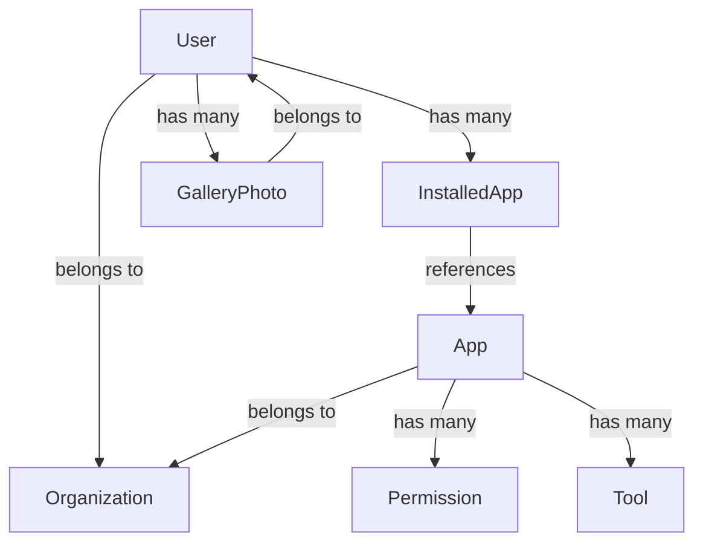

## Overview

MentraOS Cloud uses MongoDB for persistent storage of users, apps, photos, and system data. All models are defined using Mongoose schemas and follow consistent patterns for timestamps, references, and data validation.

## Location

`packages/cloud/src/models/`

## Core Models

### User Model
The central model representing MentraOS users with their preferences, installed apps, and system settings.

**Key Features:**
- Authentication data (email, hashed passwords, tokens)
- Installed apps and permissions
- User preferences and settings
- Organization associations
- Gallery photos references

### App Model
Represents third-party applications available in the MentraOS ecosystem.

**Key Features:**
- App metadata (name, description, version)
- API authentication (hashed keys)
- Webhook configurations
- Permission declarations
- Tool schemas for AI interactions
- App store status and review workflow

### Gallery Photo Model
Stores metadata for photos captured by users' smart glasses.

**Key Features:**
- S3 storage references
- User associations
- Capture metadata (timestamp, device info)
- Tags and descriptions
- Privacy settings

### Organization Model
Manages organizational accounts for enterprise deployments.

**Key Features:**
- Organization profiles
- Member management
- App sharing within organizations
- Billing and subscription data

### App Uptime Model
Tracks app availability and performance metrics.

**Key Features:**
- Uptime monitoring data
- Response time metrics
- Error tracking
- Historical performance data

### Temp Token Model
Manages temporary authentication tokens for various flows.

**Key Features:**
- Short-lived tokens for authentication
- Password reset tokens
- Email verification tokens
- Token expiration management

## Common Patterns

### Timestamps
All models include Mongoose timestamps:
```typescript
{
  timestamps: true // Adds createdAt and updatedAt
}
```

### Soft Deletes
Critical models use soft deletes for data recovery:
```typescript
{
  deletedAt: Date,
  isDeleted: { type: Boolean, default: false }
}
```

### References
Models use MongoDB ObjectId references:
```typescript
{
  userId: { type: Schema.Types.ObjectId, ref: 'User' },
  organizationId: { type: Schema.Types.ObjectId, ref: 'Organization' }
}
```

### Indexing Strategy
- Email fields indexed for authentication
- Package names indexed for app lookups
- User IDs indexed for session queries
- Compound indexes for complex queries

## Data Relationships



## Migration Strategy

The models support gradual migration from legacy fields:
- `developerId` → `organizationId` (App model)
- Individual org fields → Organization reference (User model)
- Legacy permission strings → Permission objects

## Security Considerations

1. **Password Hashing**: Bcrypt with salt rounds
2. **API Key Hashing**: SHA-256 for app API keys
3. **Token Security**: Crypto-random token generation
4. **Data Encryption**: Sensitive fields encrypted at rest
5. **Access Control**: Field-level security in schemas

## Best Practices

1. **Always use lean()** for read-only queries
2. **Validate data** before database operations
3. **Use transactions** for multi-document updates
4. **Index frequently** queried fields
5. **Avoid deep nesting** in embedded documents
6. **Use references** for large or frequently updated data

## Schema Validation

Models include built-in validation:
- Email format validation
- URL format validation
- Enum constraints for status fields
- Required field enforcement
- Custom validators for business logic

## Performance Optimization

1. **Projection**: Only fetch needed fields
2. **Pagination**: Use skip/limit for large datasets
3. **Aggregation**: Use MongoDB aggregation pipeline
4. **Caching**: Cache frequently accessed data
5. **Batch Operations**: Use bulkWrite for multiple updates