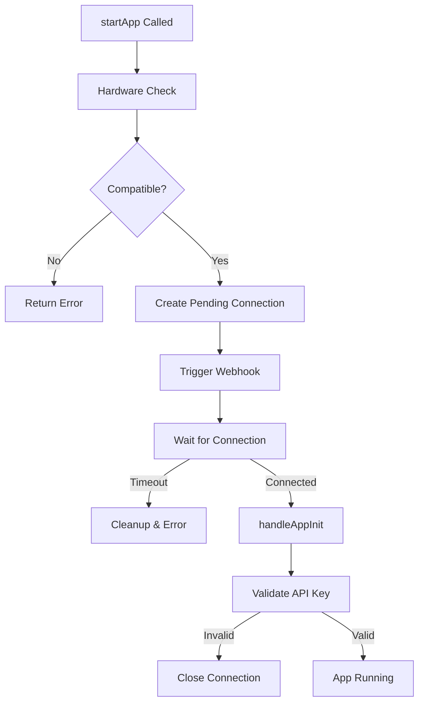

## Overview

AppManager is responsible for the complete lifecycle of third-party apps within a user session. It handles app starting, stopping, connection management, webhook triggering, and state tracking. This manager encapsulates all app-related functionality that was previously scattered throughout the codebase.

**File**: `packages/cloud/src/services/session/AppManager.ts`

## Key Responsibilities

1. **App Lifecycle Management**: Starting, stopping, and restarting apps
2. **Connection Management**: WebSocket connections and heartbeat monitoring
3. **State Tracking**: Connection states, pending operations, and app status
4. **Webhook Communication**: Triggering app webhooks for session initialization
5. **Hardware Compatibility**: Checking app requirements against device capabilities
6. **Grace Period Handling**: Managing reconnections during network interruptions

## State Management

### Connection States

```typescript
enum AppConnectionState {
  RUNNING = "running",           // Active WebSocket connection
  GRACE_PERIOD = "grace_period", // Waiting for natural reconnection (5s)
  RESURRECTING = "resurrecting", // System actively restarting app
  STOPPING = "stopping",         // User/system initiated stop in progress
  DISCONNECTED = "disconnected"  // Available for resurrection
}
```

### Internal State

```typescript
class AppManager {
  // Pending app start operations
  private pendingConnections = new Map<string, PendingConnection>();
  
  // Connection states for Apps
  private connectionStates = new Map<string, AppConnectionState>();
  
  // Heartbeat intervals for App connections
  private heartbeatIntervals = new Map<string, NodeJS.Timeout>();
  
  // App start times for session duration calculation
  private appStartTimes = new Map<string, number>();
}
```

## App Starting Process

### Start Flow



### Implementation

```typescript
async startApp(packageName: string): Promise<AppStartResult> {
  // Check if already running
  if (this.isAppRunning(packageName)) {
    return { success: true };
  }
  
  // Get app details
  const app = await appService.getApp(packageName);
  
  // Check hardware compatibility
  if (this.userSession.capabilities) {
    const compatibility = HardwareCompatibilityService.checkCompatibility(
      app, 
      this.userSession.capabilities
    );
    
    if (!compatibility.isCompatible) {
      return {
        success: false,
        error: {
          stage: "HARDWARE_CHECK",
          message: `Missing required hardware: ${compatibility.missingRequired.join(", ")}`
        }
      };
    }
  }
  
  // Create promise for connection tracking
  return new Promise((resolve, reject) => {
    const startTime = Date.now();
    
    // Set timeout for connection
    const timeout = setTimeout(async () => {
      // Handle timeout...
      resolve({
        success: false,
        error: {
          stage: "TIMEOUT",
          message: `Connection timeout after ${APP_SESSION_TIMEOUT_MS}ms`
        }
      });
    }, APP_SESSION_TIMEOUT_MS);
    
    // Store pending connection
    this.pendingConnections.set(packageName, {
      packageName,
      resolve,
      reject,
      timeout,
      startTime
    });
    
    // Trigger webhook
    this.triggerAppWebhookInternal(app, resolve, reject, startTime);
  });
}
```

### Webhook Triggering

```typescript
private async triggerAppWebhookInternal(
  app: AppI,
  resolve: (result: AppStartResult) => void,
  reject: (error: Error) => void,
  startTime: number
): Promise<void> {
  // Determine WebSocket URL based on environment
  let augmentOSWebsocketUrl = "";
  
  if (app.isSystemApp) {
    // Internal URLs for system apps
    if (process.env.PORTER_APP_NAME) {
      // Kubernetes environment
      augmentOSWebsocketUrl = `ws://${process.env.PORTER_APP_NAME}-cloud.default.svc.cluster.local:80/app-ws`;
    } else if (process.env.CONTAINER_ENVIRONMENT === "true") {
      // Docker Compose
      augmentOSWebsocketUrl = "ws://cloud/app-ws";
    } else {
      // Local development
      augmentOSWebsocketUrl = "ws://localhost:8002/app-ws";
    }
  } else {
    // Public URL for third-party apps
    augmentOSWebsocketUrl = `wss://${CLOUD_PUBLIC_HOST_NAME}/app-ws`;
  }
  
  // Trigger boot screen
  this.userSession.displayManager.handleAppStart(app.packageName);
  
  // Send webhook
  await this.triggerWebhook(`${app.publicUrl}/webhook`, {
    type: WebhookRequestType.SESSION_REQUEST,
    sessionId: `${this.userSession.userId}-${app.packageName}`,
    userId: this.userSession.userId,
    timestamp: new Date().toISOString(),
    augmentOSWebsocketUrl
  });
}
```

## Connection Handling

### App Initialization

When an app connects via WebSocket:

```typescript
async handleAppInit(ws: WebSocket, initMessage: AppConnectionInit): Promise<void> {
  const { packageName, apiKey, sessionId } = initMessage;
  
  // Validate API key
  const isValidApiKey = await developerService.validateApiKey(
    packageName, 
    apiKey, 
    this.userSession
  );
  
  if (!isValidApiKey) {
    this.resolvePendingConnectionWithError(
      packageName,
      "AUTHENTICATION",
      "Invalid API key"
    );
    ws.close(1008, "Invalid API key");
    return;
  }
  
  // Check app is in loading state
  if (!this.userSession.loadingApps.has(packageName) && 
      !this.userSession.runningApps.has(packageName)) {
    ws.close(1008, "App not started for this session");
    return;
  }
  
  // Store WebSocket connection
  this.userSession.appWebsockets.set(packageName, ws);
  
  // Set up close handler
  ws.on("close", (code, reason) => {
    this.handleAppConnectionClosed(packageName, code, reason.toString());
  });
  
  // Set up heartbeat
  this.setupAppHeartbeat(packageName, ws);
  
  // Update state
  this.setAppConnectionState(packageName, AppConnectionState.RUNNING);
  this.userSession.runningApps.add(packageName);
  this.userSession.loadingApps.delete(packageName);
  
  // Send connection acknowledgment
  const connectionAck = {
    type: CloudToAppMessageType.CONNECTION_ACK,
    sessionId: `${this.userSession.userId}-${packageName}`,
    userId: this.userSession.userId,
    capabilities: this.userSession.capabilities,
    timestamp: new Date()
  };
  
  ws.send(JSON.stringify(connectionAck));
  
  // Resolve pending connection
  this.resolvePendingConnection(packageName);
}
```

### Heartbeat System

Maintains connection health:

```typescript
private setupAppHeartbeat(packageName: string, ws: WebSocket): void {
  const HEARTBEAT_INTERVAL = 10000; // 10 seconds
  
  // Clear any existing heartbeat
  this.clearAppHeartbeat(packageName);
  
  // Set up new heartbeat
  const heartbeatInterval = setInterval(() => {
    if (ws.readyState === WebSocket.OPEN) {
      ws.ping();
    } else {
      this.clearAppHeartbeat(packageName);
    }
  }, HEARTBEAT_INTERVAL);
  
  this.heartbeatIntervals.set(packageName, heartbeatInterval);
  
  // Set up pong handler
  ws.on("pong", () => {
    // Connection still alive
  });
}
```

## App Stopping

### Stop Process

```typescript
async stopApp(packageName: string): Promise<void> {
  if (!this.isAppRunning(packageName)) {
    return;
  }
  
  // Set state to STOPPING
  this.setAppConnectionState(packageName, AppConnectionState.STOPPING);
  
  // Remove from running apps
  this.userSession.runningApps.delete(packageName);
  
  // Clear subscriptions
  subscriptionService.removeSubscriptions(
    this.userSession.userId, 
    packageName
  );
  
  // Send stop message and close connection
  const appWebsocket = this.userSession.appWebsockets.get(packageName);
  if (appWebsocket?.readyState === WebSocket.OPEN) {
    const message = {
      type: CloudToAppMessageType.APP_STOPPED,
      reason: "USER_REQUEST",
      timestamp: new Date()
    };
    
    appWebsocket.send(JSON.stringify(message));
    appWebsocket.close(1000, "App stopped");
  }
  
  // Update database
  const user = await User.findByEmail(this.userSession.userId);
  await user?.removeRunningApp(packageName);
  
  // Clean up connections
  this.userSession.appWebsockets.delete(packageName);
  
  // Clean up display and dashboard
  this.userSession.displayManager.handleAppStop(packageName);
  this.userSession.dashboardManager.cleanupAppContent(packageName);
  
  // Track metrics
  const startTime = this.appStartTimes.get(packageName);
  if (startTime) {
    const sessionDuration = Date.now() - startTime;
    await PosthogService.trackEvent("app_stop", this.userSession.userId, {
      packageName,
      sessionDuration
    });
  }
}
```

## Grace Period Handling

When an app disconnects unexpectedly:

```typescript
private handleAppConnectionClosed(
  packageName: string, 
  code: number, 
  reason: string
): void {
  const currentState = this.getAppConnectionState(packageName);
  
  // If intentionally stopping, clean up immediately
  if (currentState === AppConnectionState.STOPPING) {
    this.cleanupAppConnection(packageName);
    return;
  }
  
  // Start grace period
  this.setAppConnectionState(packageName, AppConnectionState.GRACE_PERIOD);
  
  // Set reconnection timer (5 seconds)
  const timer = setTimeout(() => {
    const state = this.getAppConnectionState(packageName);
    
    if (state === AppConnectionState.GRACE_PERIOD) {
      // Grace period expired, clean up
      this.cleanupAppConnection(packageName);
    }
  }, 5000);
  
  this.userSession._reconnectionTimers.set(packageName, timer);
}
```

## Message Handling

### Send Message to App

```typescript
async sendMessageToApp(
  packageName: string, 
  message: any
): Promise<AppMessageResult> {
  const ws = this.userSession.appWebsockets.get(packageName);
  
  if (ws?.readyState === WebSocket.OPEN) {
    ws.send(JSON.stringify(message));
    return { sent: true, resurrectionTriggered: false };
  }
  
  // Try resurrection if disconnected
  const state = this.getAppConnectionState(packageName);
  if (state === AppConnectionState.DISCONNECTED) {
    const startResult = await this.startApp(packageName);
    return {
      sent: false,
      resurrectionTriggered: true,
      error: startResult.success ? undefined : "Failed to resurrect app"
    };
  }
  
  return {
    sent: false,
    resurrectionTriggered: false,
    error: `App in ${state} state`
  };
}
```

## Cleanup

### Disposal

```typescript
dispose(): void {
  // Stop all running apps
  for (const packageName of this.userSession.runningApps) {
    this.stopApp(packageName).catch(error => {
      this.logger.error(`Error stopping app ${packageName} during disposal:`, error);
    });
  }
  
  // Clear all heartbeats
  for (const [packageName, interval] of this.heartbeatIntervals) {
    clearInterval(interval);
  }
  this.heartbeatIntervals.clear();
  
  // Clear pending connections
  for (const [packageName, pending] of this.pendingConnections) {
    clearTimeout(pending.timeout);
    pending.reject(new Error("Session disposed"));
  }
  this.pendingConnections.clear();
  
  // Clear reconnection timers
  for (const timer of this.userSession._reconnectionTimers.values()) {
    clearTimeout(timer);
  }
  this.userSession._reconnectionTimers.clear();
}
```

## Environment Configuration

AppManager adapts WebSocket URLs based on environment:

- **Local Development**: `ws://localhost:8002/app-ws`
- **Docker Compose**: `ws://cloud/app-ws` (for system apps)
- **Kubernetes (Porter)**: `ws://${APP_NAME}-cloud.default.svc.cluster.local:80/app-ws`
- **Production**: `wss://${CLOUD_PUBLIC_HOST_NAME}/app-ws`

## Best Practices

1. **Always check hardware compatibility** before starting apps
2. **Handle connection timeouts** to prevent hanging operations
3. **Implement grace periods** for network interruptions
4. **Track app metrics** for usage analytics
5. **Clean up resources** when apps stop
6. **Use appropriate URLs** based on environment and app type

## Related Documentation

- **[UserSession](/cloud-architecture/session-management/user-session-class)**: Parent container
- **[DisplayManager](/cloud-architecture/managers/display-manager)**: Handles app boot screens
- **[SubscriptionService](/cloud-architecture/services/subscription-service)**: Manages app subscriptions
- **[Hardware Compatibility](/cloud-architecture/services/hardware-compatibility)**: Capability checking