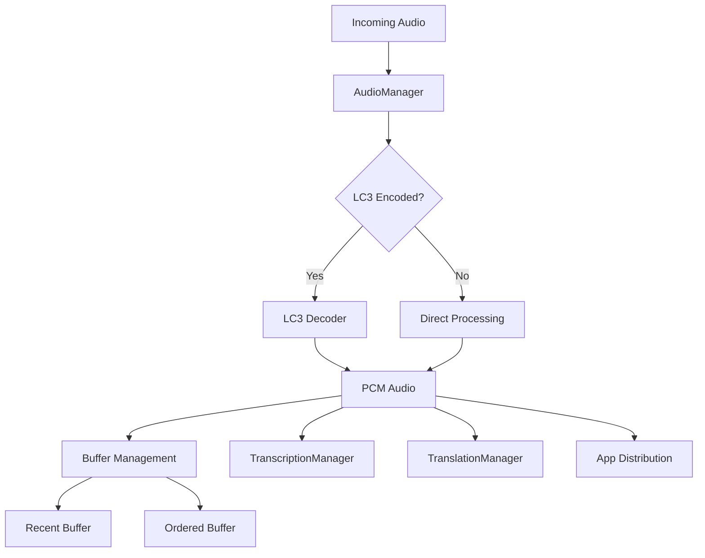

## Overview

AudioManager handles all audio-related functionality within a user session. It processes incoming audio data from smart glasses, manages buffering, handles LC3 codec decoding (when enabled), and distributes audio to transcription services and subscribed apps.

**File**: `packages/cloud/src/services/session/AudioManager.ts`

## Key Responsibilities

1. **Audio Processing**: Receives and processes raw audio data
2. **Codec Handling**: LC3 audio decoding (optional)
3. **Buffer Management**: Maintains recent audio buffer and ordered processing
4. **Service Integration**: Feeds audio to transcription and translation services
5. **App Distribution**: Relays audio to subscribed apps
6. **Debug Support**: Optional audio file writing for debugging

## Architecture



## Audio Processing Pipeline

### Main Processing Method

```typescript
async processAudioData(
  audioData: ArrayBuffer | any,
  isLC3 = this.IS_LC3
): Promise<ArrayBuffer | void> {
  // Update timestamp
  this.userSession.lastAudioTimestamp = Date.now();
  
  // Notify microphone manager
  this.userSession.microphoneManager.onAudioReceived();
  
  // Process the audio
  const processedAudioData = audioData; // Or LC3 decode if needed
  
  if (processedAudioData) {
    // Feed to services
    this.userSession.transcriptionManager.feedAudio(processedAudioData);
    this.userSession.translationManager.feedAudio(processedAudioData);
    
    // Relay to apps
    this.relayAudioToApps(processedAudioData);
  }
  
  return processedAudioData;
}
```

### LC3 Codec Support

When LC3 is enabled:

```typescript
private async processAudioInternal(
  audioData: ArrayBuffer,
  isLC3: boolean
): Promise<ArrayBuffer | void> {
  if (isLC3 && this.lc3Service) {
    try {
      // Decode LC3 to PCM
      const decodedData = await this.lc3Service.decodeAudioChunk(audioData);
      
      if (!decodedData) {
        this.logger.warn(`⚠️ LC3 decode returned null`);
        return undefined;
      }
      
      return decodedData;
    } catch (error) {
      this.logger.error(`❌ Error decoding LC3 audio:`, error);
      await this.reinitializeLc3Service();
      return undefined;
    }
  }
  
  return audioData; // Return as-is for PCM
}
```

## Buffer Management

### Recent Audio Buffer

Maintains last 10 seconds of audio:

```typescript
private addToRecentBuffer(audioData: ArrayBufferLike): void {
  const now = Date.now();
  
  // Add to buffer
  this.recentAudioBuffer.push({
    data: audioData,
    timestamp: now
  });
  
  // Prune old data (keep only last 10 seconds)
  const tenSecondsAgo = now - 10_000;
  this.recentAudioBuffer = this.recentAudioBuffer.filter(
    chunk => chunk.timestamp >= tenSecondsAgo
  );
}
```

### Ordered Audio Buffer

For handling out-of-order audio chunks:

```typescript
interface OrderedAudioBuffer {
  chunks: SequencedAudioChunk[];
  lastProcessedSequence: number;
  processingInProgress: boolean;
  expectedNextSequence: number;
  bufferSizeLimit: number;         // Max 100 chunks
  bufferTimeWindowMs: number;      // 500ms window
  bufferProcessingInterval: NodeJS.Timeout | null;
}
```

#### Adding to Ordered Buffer

```typescript
addToOrderedBuffer(chunk: SequencedAudioChunk): void {
  // Add to buffer
  this.orderedBuffer.chunks.push(chunk);
  
  // Sort by sequence number
  this.orderedBuffer.chunks.sort(
    (a, b) => a.sequenceNumber - b.sequenceNumber
  );
  
  // Enforce size limit
  if (this.orderedBuffer.chunks.length > this.orderedBuffer.bufferSizeLimit) {
    this.orderedBuffer.chunks = this.orderedBuffer.chunks.slice(
      this.orderedBuffer.chunks.length - this.orderedBuffer.bufferSizeLimit
    );
  }
}
```

#### Processing Ordered Buffer

```typescript
async processOrderedBuffer(): Promise<void> {
  if (this.orderedBuffer.processingInProgress) return;
  
  try {
    this.orderedBuffer.processingInProgress = true;
    
    for (const chunk of this.orderedBuffer.chunks) {
      // Skip already processed
      if (chunk.sequenceNumber <= this.orderedBuffer.lastProcessedSequence) {
        continue;
      }
      
      // Process the chunk
      await this.processAudioData(chunk.data, chunk.isLC3);
      
      // Update tracking
      this.orderedBuffer.lastProcessedSequence = chunk.sequenceNumber;
      this.orderedBuffer.expectedNextSequence = chunk.sequenceNumber + 1;
    }
    
    // Remove processed chunks
    this.orderedBuffer.chunks = this.orderedBuffer.chunks.filter(
      chunk => chunk.sequenceNumber > this.orderedBuffer.lastProcessedSequence
    );
  } finally {
    this.orderedBuffer.processingInProgress = false;
  }
}
```

## App Distribution

### Relay to Subscribed Apps

```typescript
private relayAudioToApps(audioData: ArrayBuffer): void {
  // Get subscribers
  const subscribedPackageNames = subscriptionService.getSubscribedApps(
    this.userSession,
    StreamType.AUDIO_CHUNK
  );
  
  if (subscribedPackageNames.length === 0) return;
  
  // Send to each subscriber
  for (const packageName of subscribedPackageNames) {
    const connection = this.userSession.appWebsockets.get(packageName);
    
    if (connection?.readyState === WebSocket.OPEN) {
      try {
        connection.send(audioData);
      } catch (sendError) {
        this.logger.error(
          `Error sending audio to ${packageName}:`, 
          sendError
        );
      }
    }
  }
}
```

## Debug Features

### Audio Writer

For debugging audio issues:

```typescript
private initializeAudioWriterIfNeeded(): void {
  if (this.DEBUG_AUDIO && !this.audioWriter) {
    this.audioWriter = new AudioWriter(this.userSession.userId);
  }
}

// Write audio data
if (this.DEBUG_AUDIO) {
  await this.audioWriter?.writePCM(processedAudioData);
  await this.audioWriter?.writeLC3(rawLC3Data);
}
```

## Service Recovery

### LC3 Service Reinitialization

Handles LC3 decoder failures:

```typescript
private async reinitializeLc3Service(): Promise<void> {
  try {
    if (this.lc3Service) {
      this.logger.warn(`⚠️ Attempting to reinitialize LC3 service`);
      
      // Clean up existing
      this.lc3Service.cleanup();
      this.lc3Service = undefined;
      
      // Create new service
      const newLc3Service = createLC3Service(this.userSession.sessionId);
      await newLc3Service.initialize();
      this.lc3Service = newLc3Service;
      
      this.logger.info(`✅ Successfully reinitialized LC3 service`);
    }
  } catch (reinitError) {
    this.logger.error(`❌ Failed to reinitialize LC3 service:`, reinitError);
  }
}
```

## Configuration

### Debug Flags

```typescript
private readonly LOG_AUDIO = false;     // Enable audio logging
private readonly DEBUG_AUDIO = false;   // Enable audio file writing
private readonly IS_LC3 = false;        // Enable LC3 processing
```

### Buffer Configuration

- **Recent Buffer**: Last 10 seconds of audio
- **Ordered Buffer Size**: Maximum 100 chunks
- **Buffer Time Window**: 500ms for ordering
- **Processing Interval**: 100ms default

## Public Methods

### Get Recent Audio Buffer

```typescript
getRecentAudioBuffer(): { data: ArrayBufferLike; timestamp: number }[] {
  return [...this.recentAudioBuffer];
}
```

## Lifecycle Management

### Initialization

```typescript
constructor(userSession: UserSession) {
  this.userSession = userSession;
  this.logger = userSession.logger.child({ service: "AudioManager" });
  
  // Initialize ordered buffer
  this.orderedBuffer = {
    chunks: [],
    lastProcessedSequence: -1,
    processingInProgress: false,
    expectedNextSequence: 0,
    bufferSizeLimit: 100,
    bufferTimeWindowMs: 500,
    bufferProcessingInterval: null
  };
  
  // Initialize LC3 if needed
  this.initializeLc3Service();
}
```

### Disposal

```typescript
dispose(): void {
  // Stop buffer processing
  this.stopOrderedBufferProcessing();
  
  // Clean up LC3 service
  if (this.lc3Service) {
    this.lc3Service.cleanup();
    this.lc3Service = undefined;
  }
  
  // Clean up audio writer
  if (this.audioWriter) {
    this.audioWriter = undefined;
  }
  
  // Clear buffers
  this.recentAudioBuffer = [];
  this.orderedBuffer.chunks = [];
  
  this.logger.info("AudioManager disposed");
}
```

## Integration Points

- **MicrophoneManager**: Notified when audio is received
- **TranscriptionManager**: Receives processed audio for speech-to-text
- **TranslationManager**: Receives audio for translation services
- **SubscriptionService**: Determines which apps receive audio
- **LC3Service**: Handles audio codec operations

## Performance Considerations

1. **Buffer Pruning**: Automatically removes old audio data
2. **Ordered Processing**: Handles out-of-order packets gracefully
3. **Error Recovery**: Reinitializes services on failure
4. **Selective Distribution**: Only sends to subscribed apps

## Best Practices

1. **Monitor Buffer Sizes** to prevent memory issues
2. **Handle LC3 Failures** with automatic recovery
3. **Use Debug Flags** sparingly in production
4. **Process Audio Efficiently** to maintain real-time performance
5. **Clean Up Resources** properly on disposal

## Related Documentation

- **[MicrophoneManager](/cloud-architecture/managers/microphone-manager)**: Controls audio input
- **[TranscriptionManager](/cloud-architecture/managers/transcription-manager)**: Speech-to-text processing
- **[TranslationManager](/cloud-architecture/managers/translation-manager)**: Language translation
- **[SubscriptionService](/cloud-architecture/services/subscription-service)**: App audio subscriptions