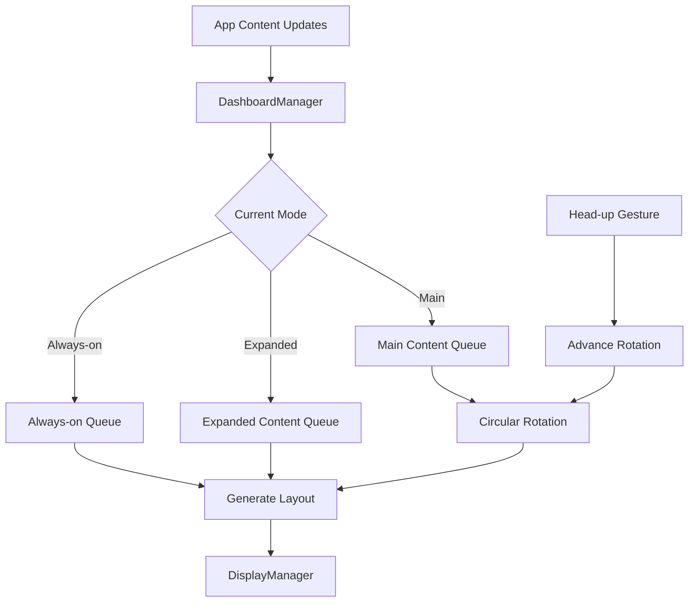

## Overview

DashboardManager handles dashboard content and layouts across the system. It provides contextual information to users through various display modes, manages content from multiple apps, implements circular queue rotation for content cycling, and supports system-level dashboard updates.

**File**: `packages/cloud/src/services/dashboard/DashboardManager.ts`

## Key Features

1. **Multiple Display Modes**: Main, Expanded, and Always-on dashboard modes
2. **Content Rotation**: Circular queue for cycling through app content
3. **Head Gesture Support**: Look-up gesture cycles through content
4. **System Content Management**: Dedicated sections for system information
5. **App Content Integration**: Apps can submit content for different modes
6. **Mode Authorization**: Only system dashboard app can change modes
7. **Flexible Layouts**: Supports various layout types for different contexts

## Architecture



## Dashboard Modes

### Mode Types

```typescript
enum DashboardMode {
  MAIN = "main",        // Full dashboard with all sections
  EXPANDED = "expanded", // More space for app content
  ALWAYS_ON = "always_on" // Persistent minimal overlay
}
```

### Mode Characteristics

1. **Main Mode**
   - Full dashboard experience
   - System info in all corners
   - Rotating app content
   - Head-up gesture support

2. **Expanded Mode**
   - Minimal system info (single line)
   - More space for app content
   - Latest content displayed

3. **Always-on Mode**
   - Persistent overlay
   - Essential info only
   - Minimal visual footprint

## Content Management

### Content Structure

```typescript
interface AppContent {
  packageName: string;
  content: string | Layout;
  timestamp: Date;
}

interface SystemContent {
  topLeft: string;      // Time/date info
  topRight: string;     // Battery/status
  bottomLeft: string;   // Notifications
  bottomRight: string;  // System info
}
```

### Content Queues

```typescript
// Separate queues for each mode
private mainContent: Map<string, AppContent> = new Map();
private expandedContent: Map<string, AppContent> = new Map();
private alwaysOnContent: Map<string, AppContent> = new Map();

// Rotation tracking for main mode
private mainContentRotationIndex: number = 0;
```

## Head Gesture Support

### Head-up Handler

```typescript
public onHeadsUp(): void {
  // Only in main mode
  if (this.currentMode !== DashboardMode.MAIN) {
    return;
  }
  
  // Need multiple items to cycle
  if (this.mainContent.size <= 1) {
    return;
  }
  
  // Advance rotation index
  this.mainContentRotationIndex = 
    (this.mainContentRotationIndex + 1) % this.mainContent.size;
  
  // Update display
  this.updateDashboard();
}
```

### Circular Queue Implementation

```typescript
private getNextMainAppContent(): string {
  const contentArray = Array.from(this.mainContent.values());
  
  if (contentArray.length === 0) return "";
  if (contentArray.length === 1) {
    return this.extractTextFromContent(contentArray[0].content);
  }
  
  // Sort by timestamp for consistent ordering
  contentArray.sort((a, b) => {
    const aTime = a.timestamp.getTime();
    const bTime = b.timestamp.getTime();
    return bTime - aTime;  // Newest first
  });
  
  // Use rotation index
  const currentIndex = this.mainContentRotationIndex % contentArray.length;
  const selectedContent = contentArray[currentIndex];
  
  return this.extractTextFromContent(selectedContent.content);
}
```

## Message Handling

### Content Update

```typescript
handleDashboardContentUpdate(message: DashboardContentUpdate): void {
  const { packageName, content, modes, timestamp } = message;
  
  // Add to requested mode queues
  modes.forEach(mode => {
    switch (mode) {
      case DashboardMode.MAIN:
        this.mainContent.set(packageName, {
          packageName,
          content,
          timestamp
        });
        break;
      case DashboardMode.EXPANDED:
        this.expandedContent.set(packageName, {
          packageName,
          content,
          timestamp
        });
        break;
    }
  });
  
  // Update if current mode was affected
  if (modes.includes(this.currentMode as DashboardMode)) {
    this.updateDashboard();
  }
}
```

### Mode Change

```typescript
handleDashboardModeChange(message: DashboardModeChange): void {
  const { packageName, mode } = message;
  
  // Only system dashboard can change mode
  if (packageName !== SYSTEM_DASHBOARD_PACKAGE_NAME) {
    this.logger.warn(`Unauthorized mode change from ${packageName}`);
    return;
  }
  
  this.setDashboardMode(mode);
}
```

### System Update

```typescript
handleDashboardSystemUpdate(message: DashboardSystemUpdate): void {
  const { packageName, section, content } = message;
  
  // Only system dashboard can update system sections
  if (packageName !== SYSTEM_DASHBOARD_PACKAGE_NAME) {
    this.logger.warn(`Unauthorized system update from ${packageName}`);
    return;
  }
  
  // Update section (topLeft, topRight, bottomLeft, bottomRight)
  this.systemContent[section] = content;
  this.updateDashboard();
}
```

## Layout Generation

### Main Mode Layout

```typescript
private generateMainLayout(): Layout {
  const leftText = this.formatSystemLeftSection();
  const rightText = this.formatSystemRightSection();
  
  return {
    layoutType: LayoutType.DOUBLE_TEXT_WALL,
    topText: leftText,     // System info + notifications
    bottomText: rightText  // System info + rotating app content
  };
}

private formatSystemLeftSection(): string {
  const systemLine = this.systemContent.topLeft;
  
  if (this.systemContent.bottomLeft) {
    return `${systemLine}\n${this.systemContent.bottomLeft}`;
  }
  
  return systemLine;
}

private formatSystemRightSection(): string {
  const appContent = this.getNextMainAppContent();
  
  if (this.systemContent.bottomRight) {
    return `${this.systemContent.topRight}\n${this.systemContent.bottomRight}\n\n${appContent}`;
  }
  
  return `${this.systemContent.topRight}\n${appContent}`;
}
```

### Expanded Mode Layout

```typescript
private generateExpandedLayout(): Layout {
  // Single line of system info
  const systemInfoLine = `${this.systemContent.topLeft} | ${this.systemContent.topRight}`;
  
  // Most recent app content
  const content = Array.from(this.expandedContent.values())
    .sort((a, b) => b.timestamp.getTime() - a.timestamp.getTime())
    .slice(0, 1)[0];
  
  const appContent = content ? content.content as string : "";
  const fullText = appContent 
    ? `${systemInfoLine}\n${appContent}`
    : `${systemInfoLine}\nNo expanded content available`;
  
  return {
    layoutType: LayoutType.TEXT_WALL,
    text: fullText
  };
}
```

## Content Extraction

```typescript
private extractTextFromContent(content: string | Layout): string {
  if (typeof content === "string") {
    return content;
  }
  
  // Handle different layout types
  switch (content.layoutType) {
    case LayoutType.TEXT_WALL:
      return content.text || "";
    case LayoutType.DOUBLE_TEXT_WALL:
      return [content.topText, content.bottomText]
        .filter(Boolean).join("\n");
    case LayoutType.DASHBOARD_CARD:
      return [content.leftText, content.rightText]
        .filter(Boolean).join(" | ");
    case LayoutType.REFERENCE_CARD:
      return `${content.title}\n${content.text}`;
    default:
      return "";
  }
}
```

## App Disconnection Handling

```typescript
public cleanupAppContent(packageName: string): void {
  const hadMainContent = this.mainContent.has(packageName);
  const mainContentSizeBefore = this.mainContent.size;
  
  // Remove from all queues
  this.mainContent.delete(packageName);
  this.expandedContent.delete(packageName);
  this.alwaysOnContent.delete(packageName);
  
  // Adjust rotation index if needed
  if (hadMainContent && mainContentSizeBefore > 1) {
    const newMainContentSize = this.mainContent.size;
    
    // Reset if out of bounds
    if (this.mainContentRotationIndex >= newMainContentSize) {
      this.mainContentRotationIndex = 0;
    }
  }
  
  // Update displays
  this.updateDashboard();
  
  if (this.alwaysOnContent.has(packageName) && this.alwaysOnEnabled) {
    this.updateAlwaysOnDashboard();
  }
}
```

## Display Integration

```typescript
private sendDisplayRequest(displayRequest: DisplayRequest): void {
  // Use DisplayManager for actual display
  const sent = this.userSession.displayManager.handleDisplayRequest(displayRequest);
  
  if (!sent) {
    this.logger.warn("Display request not sent - DisplayManager not ready");
    return;
  }
  
  this.logger.debug({
    packageName: displayRequest.packageName,
    view: displayRequest.view,
    layoutType: displayRequest.layout.layoutType
  }, "Display request sent successfully");
}
```

## Configuration

```typescript
interface DashboardConfig {
  queueSize?: number;          // Max items per queue (default: 5)
  updateIntervalMs?: number;   // Update interval (default: 45000ms)
  alwaysOnEnabled?: boolean;   // Always-on mode state (default: false)
  initialMode?: DashboardMode; // Starting mode (default: MAIN)
}
```

## Lifecycle Management

### Disposal

```typescript
public dispose(): void {
  // Clear update interval
  if (this.updateInterval) {
    clearInterval(this.updateInterval);
    this.updateInterval = null;
  }
  
  // Clear all content
  this.mainContent.clear();
  this.expandedContent.clear();
  this.alwaysOnContent.clear();
  
  this.logger.info("Dashboard Manager disposed");
}
```

## Best Practices

1. **Respect mode authorization** - Only system dashboard can change modes
2. **Handle content rotation carefully** - Maintain index bounds
3. **Sort content by timestamp** for consistent ordering
4. **Extract text properly** from different layout types
5. **Clean up on app disconnect** to prevent stale content
6. **Use appropriate layouts** for each dashboard mode
7. **Log state transitions** for debugging

## Integration Points

- **DisplayManager**: Sends display requests
- **AppManager**: Validates app connections
- **WebSocket Service**: Receives app messages
- **Head Tracking**: Processes head-up gestures

## Related Documentation

- **[DisplayManager](/cloud-architecture/managers/display-manager)**: Display handling
- **[AppManager](/cloud-architecture/managers/app-manager)**: App state management
- **[Message Types](/cloud-overview/message-types)**: Dashboard message formats
- **[Layout Types](/sdk/display-layouts)**: Available display layouts