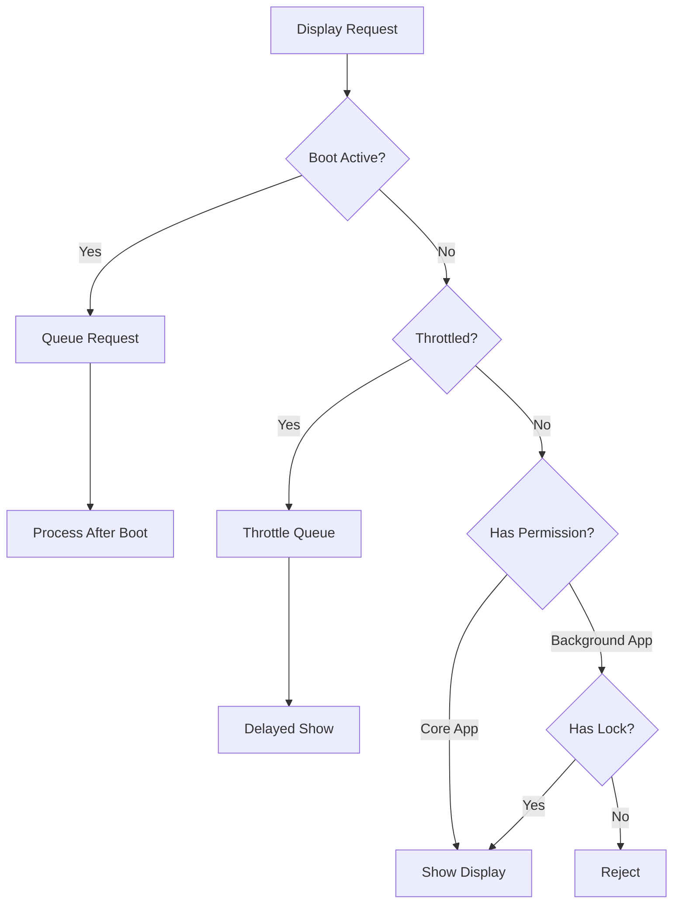

## Overview

DisplayManager is responsible for managing what appears on the smart glasses display. It handles display requests from apps, implements throttling to prevent display flicker, manages boot screens, handles onboarding flows, and enforces display priorities between foreground and background apps.

**File**: `packages/cloud/src/services/layout/DisplayManager6.1.ts`

## Key Features

1. **Display Throttling**: 300ms minimum between updates to prevent flicker
2. **Boot Screen Management**: Shows loading screens while apps start
3. **App Prioritization**: Manages display conflicts between apps
4. **Background Lock System**: Allows background apps temporary display control
5. **Onboarding Support**: Shows first-time user instructions
6. **Queue Management**: Handles display requests during boot and throttling

## Architecture



## State Management

### Display State

```typescript
interface DisplayState {
  currentDisplay: ActiveDisplay | null;      // Currently showing
  coreAppDisplay: ActiveDisplay | null;      // Core app's queued display
  backgroundLock: {                          // Background app lock
    packageName: string;
    expiresAt: Date;
    lastActiveTime: number;
  } | null;
  savedDisplayBeforeBoot: ActiveDisplay | null; // Saved during boot
}
```

### Throttling System

```typescript
private throttledRequests: Map<string, ThrottledRequest> = new Map();

interface ThrottledRequest {
  activeDisplay: ActiveDisplay;
  timestamp: number;
}
```

## Display Request Processing

### Main Entry Point

```typescript
handleDisplayRequest(displayRequest: DisplayRequest): boolean {
  // Check if app is booting
  if (this.bootingApps.has(displayRequest.packageName)) {
    this.queueBootDisplay(displayRequest);
    return true;
  }
  
  // Handle dashboard requests (always allowed)
  if (displayRequest.packageName === SYSTEM_DASHBOARD_PACKAGE_NAME) {
    return this.showDisplay(this.createActiveDisplay(displayRequest));
  }
  
  // Handle core app display
  if (displayRequest.packageName === this.mainApp) {
    const activeDisplay = this.createActiveDisplay(displayRequest);
    this.displayState.coreAppDisplay = activeDisplay;
    
    // Check if blocked by background app
    const blockedByBackgroundApp = 
      this.displayState.backgroundLock &&
      this.displayState.backgroundLock?.packageName !== this.mainApp &&
      this.displayState.currentDisplay?.displayRequest.packageName === 
        this.displayState.backgroundLock?.packageName;
    
    if (!blockedByBackgroundApp) {
      return this.showDisplay(activeDisplay);
    }
    
    return false; // Blocked
  }
  
  // Handle background app display
  const canDisplay = this.canBackgroundAppDisplay(displayRequest.packageName);
  if (canDisplay) {
    return this.showDisplay(this.createActiveDisplay(displayRequest));
  }
  
  return false;
}
```

## Throttling Implementation

### Show Display with Throttling

```typescript
private showDisplay(activeDisplay: ActiveDisplay): boolean {
  const displayRequest = activeDisplay.displayRequest;
  
  // Block during onboarding (except onboarding displays)
  if (this.onboardingActive && Date.now() < this.onboardingEndTime) {
    if (!(displayRequest.layout?.layoutType === LayoutType.REFERENCE_CARD && 
          displayRequest.layout.title === 'Welcome')) {
      return false;
    }
  }
  
  // Check throttle
  if (Date.now() - this.lastDisplayTime < this.THROTTLE_DELAY && 
      !displayRequest.forceDisplay) {
    this.enqueueThrottledDisplay(activeDisplay);
    return true; // Accepted but queued
  }
  
  // Send immediately
  const success = this.sendToWebSocket(displayRequest, this.userSession?.websocket);
  if (success) {
    this.displayState.currentDisplay = activeDisplay;
    this.lastDisplayTime = Date.now();
    
    // Set expiry timeout if duration specified
    if (activeDisplay.expiresAt) {
      const timeUntilExpiry = activeDisplay.expiresAt.getTime() - Date.now();
      setTimeout(() => {
        if (this.displayState.currentDisplay === activeDisplay) {
          this.showNextDisplay('duration_expired');
        }
      }, timeUntilExpiry);
    }
  }
  
  return success;
}
```

### Throttle Queue Processing

```typescript
private enqueueThrottledDisplay(activeDisplay: ActiveDisplay): void {
  const packageName = activeDisplay.displayRequest.packageName;
  
  // Add to queue (overwrites previous request from same app)
  this.throttledRequests.set(packageName, {
    activeDisplay,
    timestamp: Date.now()
  });
  
  // Schedule display after throttle delay
  setTimeout(() => {
    const currentRequest = this.throttledRequests.get(packageName);
    if (currentRequest?.activeDisplay === activeDisplay) {
      this.sendToWebSocket(activeDisplay.displayRequest, this.userSession?.websocket);
      this.displayState.currentDisplay = activeDisplay;
      this.lastDisplayTime = Date.now();
      this.throttledRequests.delete(packageName);
    }
  }, this.THROTTLE_DELAY);
}
```

## Boot Screen Management

### App Start Handler

```typescript
public handleAppStart(packageName: string): void {
  const app = this.userSession.installedApps.get(packageName);
  
  // Set main app if standard type
  if (app?.appType === 'standard') {
    this.mainApp = packageName;
  }
  
  // Skip boot screen for dashboard
  if (packageName === SYSTEM_DASHBOARD_PACKAGE_NAME) {
    return;
  }
  
  // Save current display if valid
  if (this.displayState.currentDisplay) {
    const currentPackage = this.displayState.currentDisplay.displayRequest.packageName;
    const displayIsValid = this.hasRemainingDuration(this.displayState.currentDisplay);
    
    if (this.userSession.runningApps.has(currentPackage) && displayIsValid) {
      this.displayState.savedDisplayBeforeBoot = this.displayState.currentDisplay;
    }
  }
  
  // Show boot screen
  this.bootingApps.add(packageName);
  this.updateBootScreen();
  
  // Complete boot after duration
  setTimeout(async () => {
    this.bootingApps.delete(packageName);
    if (this.bootingApps.size === 0) {
      this.clearDisplay('main');
      this.processBootQueue();
      
      // Check onboarding
      if (packageName !== SYSTEM_DASHBOARD_PACKAGE_NAME) {
        await this.checkAndShowOnboarding(packageName);
      }
    }
  }, this.BOOT_DURATION);
}
```

### Boot Screen Display

```typescript
private updateBootScreen(): void {
  const bootingAppNames = Array.from(this.bootingApps).join(', ');
  const bootRequest: DisplayRequest = {
    type: AppToCloudMessageType.DISPLAY_REQUEST,
    view: ViewType.MAIN,
    packageName: 'system.boot',
    layout: {
      layoutType: LayoutType.TEXT_WALL,
      text: `Loading ${bootingAppNames}...`
    },
    timestamp: new Date(),
    forceDisplay: true
  };
  
  this.sendToWebSocket(bootRequest, this.userSession?.websocket);
}
```

## Background Lock System

### Lock Request

```typescript
requestBackgroundLock(packageName: string, durationMs: number = 10000): boolean {
  if (this.displayState.backgroundLock) {
    const now = Date.now();
    
    // Check if existing lock is expired or inactive
    if (this.displayState.backgroundLock.expiresAt.getTime() > now &&
        now - this.displayState.backgroundLock.lastActiveTime < this.LOCK_INACTIVE_TIMEOUT) {
      return false; // Active lock exists
    }
  }
  
  // Grant lock
  this.displayState.backgroundLock = {
    packageName,
    expiresAt: new Date(Date.now() + durationMs),
    lastActiveTime: Date.now()
  };
  
  return true;
}
```

### Lock Validation

```typescript
private canBackgroundAppDisplay(packageName: string): boolean {
  if (!this.displayState.backgroundLock) {
    return false;
  }
  
  const now = Date.now();
  
  // Check lock ownership and validity
  if (this.displayState.backgroundLock.packageName !== packageName) {
    return false;
  }
  
  if (this.displayState.backgroundLock.expiresAt.getTime() <= now) {
    this.displayState.backgroundLock = null;
    return false;
  }
  
  // Check if lock holder has been inactive
  if (now - this.displayState.backgroundLock.lastActiveTime > this.LOCK_INACTIVE_TIMEOUT) {
    this.displayState.backgroundLock = null;
    return false;
  }
  
  return true;
}
```

## Display Priority Logic

### Show Next Display

```typescript
private showNextDisplay(reason: string): void {
  // Boot screen takes precedence
  if (this.bootingApps.size > 0) {
    this.updateBootScreen();
    return;
  }
  
  // Check throttled requests first
  if (this.throttledRequests.size > 0) {
    const oldestRequest = this.findOldestThrottledRequest();
    if (oldestRequest) {
      this.showThrottledDisplay(oldestRequest);
      return;
    }
  }
  
  // Try saved display from before boot
  if (reason === 'boot_complete' && this.displayState.savedDisplayBeforeBoot) {
    if (this.isDisplayStillValid(this.displayState.savedDisplayBeforeBoot)) {
      this.restoreSavedDisplay();
      return;
    }
  }
  
  // Show core app display if available
  if (this.displayState.coreAppDisplay && 
      this.isDisplayStillValid(this.displayState.coreAppDisplay)) {
    this.showDisplay(this.displayState.coreAppDisplay);
    return;
  }
  
  // Clear display
  this.clearDisplay('main');
}
```

## Onboarding Support

### Check and Show Onboarding

```typescript
private async checkAndShowOnboarding(packageName: string): Promise<void> {
  const userEmail = this.userSession.userId;
  
  try {
    const onboardingStatus = await this.getOnboardingStatus(userEmail, packageName);
    
    if (!onboardingStatus) {
      const instructions = await this.getOnboardingInstructions(packageName);
      
      if (instructions) {
        const onboardingDisplay: DisplayRequest = {
          type: AppToCloudMessageType.DISPLAY_REQUEST,
          view: ViewType.MAIN,
          packageName,
          layout: {
            layoutType: LayoutType.TEXT_WALL,
            text: instructions
          },
          timestamp: new Date(),
          durationMs: 15000
        };
        
        this.onboardingActive = true;
        this.onboardingEndTime = Date.now() + 5000;
        this.sendDisplay(onboardingDisplay);
        
        await this.completeOnboarding(userEmail, packageName);
      }
    }
  } catch (err) {
    this.logger.error({ err }, `Error handling onboarding for ${packageName}`);
  }
}
```

## Configuration

### Timing Constants

```typescript
private readonly THROTTLE_DELAY = 300;        // 300ms between displays
private readonly BOOT_DURATION = 1500;        // 1.5s boot screen
private readonly LOCK_TIMEOUT = 10000;        // 10s background lock
private readonly LOCK_INACTIVE_TIMEOUT = 2000; // 2s inactivity timeout
```

## Lifecycle Management

### Disposal

```typescript
dispose(): void {
  // Clear all timeouts and intervals
  this.throttledRequests.clear();
  this.bootDisplayQueue.clear();
  this.bootingApps.clear();
  
  // Reset state
  this.displayState = {
    currentDisplay: null,
    coreAppDisplay: null,
    backgroundLock: null,
    savedDisplayBeforeBoot: null
  };
  
  this.logger.info(`DisplayManager disposed`);
}
```

## Best Practices

1. **Always respect throttling** unless `forceDisplay` is set
2. **Save displays during boot** for restoration afterward
3. **Validate display ownership** before showing saved displays
4. **Handle onboarding gracefully** without blocking other displays
5. **Clean up expired locks** to prevent display blocking
6. **Use appropriate display types** (TEXT_WALL, REFERENCE_CARD, etc.)

## Integration Points

- **AppManager**: Notifies of app start/stop for boot screens
- **DashboardManager**: Special handling for system dashboard
- **WebSocket**: Sends display updates to glasses
- **Onboarding Service**: Checks and completes onboarding

## Related Documentation

- **[AppManager](/cloud-architecture/managers/app-manager)**: Triggers boot screens
- **[DashboardManager](/cloud-architecture/managers/dashboard-manager)**: System dashboard
- **[Layout Types](/sdk/display-layouts)**: Available display formats
- **[Message Types](/cloud-overview/message-types)**: Display request format