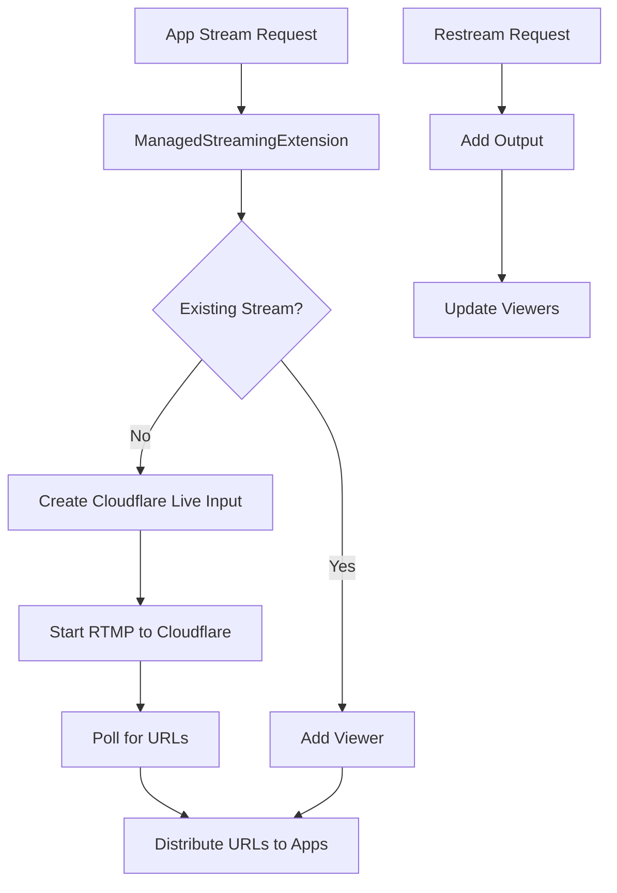

## Overview

ManagedStreamingExtension works alongside VideoManager to provide managed streaming capabilities. It enables multiple apps to view the same stream, handles Cloudflare Live streaming infrastructure, supports restreaming to multiple destinations, and provides automatic URL discovery for HLS/DASH/WebRTC playback.

**File**: `packages/cloud/src/services/streaming/ManagedStreamingExtension.ts`

## Key Features

1. **Multi-Viewer Support**: Multiple apps can view the same stream
2. **Cloudflare Integration**: Uses Cloudflare Live for stream infrastructure
3. **Restream Capabilities**: Add/remove multiple RTMP output destinations
4. **Automatic URL Discovery**: Polls for and distributes playback URLs
5. **Conflict Management**: Prevents conflicts between managed/unmanaged streams
6. **Keep-Alive System**: Maintains stream health with ACK tracking
7. **Per-App Output Control**: Apps manage their own restream outputs

## Architecture



## Stream Management

### Managed Stream State

```typescript
interface ManagedStreamState {
  streamId: string;
  userId: string;
  type: 'managed';
  cfLiveInputId: string;      // Cloudflare Live Input ID
  cfIngestUrl: string;         // RTMP ingest URL
  activeViewers: Set<string>;  // App package names
  hlsUrl?: string;             // HLS playback URL
  dashUrl?: string;            // DASH playback URL
  webrtcUrl?: string;          // WebRTC playback URL
  outputs?: Array<{            // Restream outputs
    cfOutputId: string;
    url: string;
    name?: string;
    addedBy: string;          // App that added it
    status?: CloudflareOutput;
  }>;
  createdAt: Date;
  lastActivity: Date;
}
```

### Stream Creation

```typescript
async startManagedStream(
  userSession: UserSession,
  request: ManagedStreamRequest
): Promise<string> {
  const { packageName, quality, enableWebRTC, video, audio } = request;
  
  // Validation
  if (!userSession.appManager.isAppRunning(packageName)) {
    throw new Error(`App ${packageName} is not running`);
  }
  
  // Check conflicts
  const conflict = this.stateManager.checkStreamConflict(userId, "managed");
  if (conflict.hasConflict) {
    throw new Error(conflict.message);
  }
  
  // Check for existing stream
  const existingStream = this.stateManager.getStreamState(userId);
  if (existingStream && existingStream.type === "managed") {
    // Add as viewer to existing stream
    const managedStream = this.stateManager.createOrJoinManagedStream({
      userId,
      appId: packageName,
      liveInput: {
        liveInputId: existingStream.cfLiveInputId,
        rtmpUrl: existingStream.cfIngestUrl,
        hlsUrl: existingStream.hlsUrl,
        dashUrl: existingStream.dashUrl,
        webrtcUrl: existingStream.webrtcUrl
      }
    });
    
    return managedStream.streamId;
  }
  
  // Create new Cloudflare live input
  const liveInput = await this.cloudflareService.createLiveInput(userId, {
    quality,
    enableWebRTC,
    enableRecording: true,    // Required for playback
    requireSignedURLs: false, // Public streams
    restreamDestinations
  });
  
  // Create managed stream state
  const managedStream = this.stateManager.createOrJoinManagedStream({
    userId,
    appId: packageName,
    liveInput
  });
  
  // Start keep-alive
  this.startKeepAlive(userId, managedStream.streamId, managedStream.cfLiveInputId);
  
  // Send start to glasses with Cloudflare URL
  const startMessage: StartRtmpStream = {
    type: CloudToGlassesMessageType.START_RTMP_STREAM,
    sessionId: userSession.sessionId,
    rtmpUrl: liveInput.rtmpUrl,  // Cloudflare ingest URL
    appId: "MANAGED_STREAM",      // Special identifier
    streamId: managedStream.streamId,
    video: video || {},
    audio: audio || {},
    timestamp: new Date()
  };
  
  userSession.websocket.send(JSON.stringify(startMessage));
  
  // Start polling for playback URLs
  this.startPlaybackUrlPolling(userId, packageName, managedStream);
  
  return managedStream.streamId;
}
```

## URL Discovery

### Polling System

```typescript
private startPlaybackUrlPolling(
  userId: string,
  packageName: string,
  managedStream: ManagedStreamState
): void {
  const pollInterval = setInterval(async () => {
    // Check if stream still active
    const currentStream = this.stateManager.getStreamState(userId);
    if (!currentStream || currentStream.type !== "managed" || 
        currentStream.streamId !== managedStream.streamId) {
      clearInterval(pollInterval);
      return;
    }
    
    // Check if URLs already discovered
    if (managedStream.hlsUrl && managedStream.dashUrl) {
      clearInterval(pollInterval);
      return;
    }
    
    // Check if stream is live
    const isLive = await this.cloudflareService.waitForStreamLive(
      managedStream.cfLiveInputId,
      1,  // One attempt
      0   // No delay
    );
    
    if (isLive) {
      // Send URLs to all viewers
      for (const appId of managedStream.activeViewers) {
        await this.sendManagedStreamStatus(
          userSession,
          appId,
          managedStream.streamId,
          "active",
          "Stream is now live",
          managedStream.hlsUrl,
          managedStream.dashUrl,
          managedStream.webrtcUrl
        );
      }
      
      clearInterval(pollInterval);
    }
  }, 2000);  // Poll every 2 seconds
  
  // Timeout after 60 seconds
  setTimeout(() => {
    if (this.pollingIntervals.get(userId) === pollInterval) {
      clearInterval(pollInterval);
      this.pollingIntervals.delete(userId);
    }
  }, 60000);
}
```

## Restream Management

### Add Output

```typescript
async addRestreamOutput(
  streamId: string,
  packageName: string,
  destination: { url: string; name?: string }
): Promise<{ success: boolean; outputId?: string; error?: string }> {
  const stream = this.stateManager.getStreamByStreamId(streamId);
  if (!stream || stream.type !== "managed") {
    return { success: false, error: "STREAM_NOT_FOUND" };
  }
  
  // Check limits
  const MAX_OUTPUTS_PER_STREAM = 10;
  const MAX_OUTPUTS_PER_APP = 10;
  
  if (stream.outputs.length >= MAX_OUTPUTS_PER_STREAM) {
    return { 
      success: false, 
      error: "MAX_OUTPUTS_REACHED",
      message: `Stream has reached maximum of ${MAX_OUTPUTS_PER_STREAM} outputs`
    };
  }
  
  const appOutputCount = stream.outputs
    .filter(o => o.addedBy === packageName).length;
  if (appOutputCount >= MAX_OUTPUTS_PER_APP) {
    return { 
      success: false, 
      error: "MAX_APP_OUTPUTS_REACHED",
      message: `Your app has reached maximum of ${MAX_OUTPUTS_PER_APP} outputs`
    };
  }
  
  // Check for duplicate
  if (stream.outputs.some(o => o.url === destination.url)) {
    return { 
      success: false, 
      error: "DUPLICATE_URL",
      message: "This RTMP URL is already configured"
    };
  }
  
  // Create via Cloudflare
  const cfOutputs = await this.cloudflareService.createOutputs(
    stream.cfLiveInputId,
    [destination]
  );
  
  const cfOutput = cfOutputs[0];
  
  // Add to stream state with ownership
  stream.outputs.push({
    cfOutputId: cfOutput.uid,
    url: destination.url,
    name: destination.name,
    addedBy: packageName,
    status: cfOutput
  });
  
  // Notify all viewers
  await this.notifyOutputsChanged(stream);
  
  return { success: true, outputId: cfOutput.uid };
}
```

### Remove Output

```typescript
async removeRestreamOutput(
  streamId: string,
  outputId: string,
  packageName: string
): Promise<{ success: boolean; error?: string }> {
  const stream = this.stateManager.getStreamByStreamId(streamId);
  const output = stream.outputs.find(o => o.cfOutputId === outputId);
  
  // Check ownership
  if (output.addedBy !== packageName) {
    return { 
      success: false, 
      error: "NOT_AUTHORIZED",
      message: "You can only remove outputs that you added"
    };
  }
  
  // Remove from Cloudflare
  await this.cloudflareService.deleteOutput(stream.cfLiveInputId, outputId);
  
  // Remove from state
  stream.outputs = stream.outputs.filter(o => o.cfOutputId !== outputId);
  
  // Notify viewers
  await this.notifyOutputsChanged(stream);
  
  return { success: true };
}
```

## Keep-Alive System

### Keep-Alive Management

```typescript
interface ManagedStreamKeepAlive {
  userId: string;
  streamId: string;
  cfLiveInputId: string;
  keepAliveTimer?: NodeJS.Timeout;
  lastKeepAlive: Date;
  pendingAcks: Map<string, { sentAt: Date; timeout: NodeJS.Timeout }>;
  missedAcks: number;
}

private startKeepAlive(
  userId: string,
  streamId: string,
  cfLiveInputId: string
): void {
  const keepAlive: ManagedStreamKeepAlive = {
    userId,
    streamId,
    cfLiveInputId,
    lastKeepAlive: new Date(),
    pendingAcks: new Map(),
    missedAcks: 0
  };
  
  // Schedule periodic keep-alive
  keepAlive.keepAliveTimer = setInterval(() => {
    this.sendKeepAlive(userId);
  }, KEEP_ALIVE_INTERVAL_MS);  // 15 seconds
  
  this.managedKeepAlive.set(userId, keepAlive);
}
```

### ACK Handling

```typescript
handleKeepAliveAck(userId: string, ack: KeepAliveAck): void {
  const keepAlive = this.managedKeepAlive.get(userId);
  if (!keepAlive) return;
  
  const ackInfo = keepAlive.pendingAcks.get(ack.ackId);
  if (ackInfo) {
    clearTimeout(ackInfo.timeout);
    keepAlive.pendingAcks.delete(ack.ackId);
    keepAlive.missedAcks = 0;  // Reset on successful ACK
    keepAlive.lastKeepAlive = new Date();
  }
}
```

## Status Management

### Status Distribution

```typescript
private async sendManagedStreamStatus(
  userSession: UserSession,
  packageName: string,
  streamId: string,
  status: ManagedStreamStatus["status"],
  message?: string,
  hlsUrl?: string,
  dashUrl?: string,
  webrtcUrl?: string
): Promise<void> {
  const stream = this.stateManager.getStreamByStreamId(streamId);
  
  // Convert outputs to status format
  let outputs: OutputStatus[] | undefined;
  if (stream.outputs && stream.outputs.length > 0) {
    outputs = stream.outputs.map(output => ({
      url: output.url,
      name: output.name,
      status: output.status?.status?.current?.state === "connected" 
        ? "active" 
        : output.status?.status?.current?.state === "error"
          ? "error"
          : "stopped",
      error: output.status?.status?.current?.lastError
    }));
  }
  
  const statusMessage: ManagedStreamStatus = {
    type: CloudToAppMessageType.MANAGED_STREAM_STATUS,
    status,
    hlsUrl: hlsUrl !== undefined ? hlsUrl : stream.hlsUrl,
    dashUrl: dashUrl !== undefined ? dashUrl : stream.dashUrl,
    webrtcUrl: webrtcUrl !== undefined ? webrtcUrl : stream.webrtcUrl,
    streamId,
    message,
    outputs
  };
  
  // Check for duplicate status
  const statusKey = `${streamId}:${packageName}`;
  const lastStatus = this.lastSentStatus.get(statusKey);
  
  if (lastStatus && this.isDuplicateStatus(lastStatus, statusMessage)) {
    return;  // Skip duplicate
  }
  
  // Send to app
  const appWs = userSession.appWebsockets.get(packageName);
  appWs.send(JSON.stringify(statusMessage));
  
  // Track last sent
  this.lastSentStatus.set(statusKey, statusMessage);
}
```

## Conflict Detection

```typescript
checkUnmanagedStreamConflict(userId: string): boolean {
  const conflict = this.stateManager.checkStreamConflict(userId, "unmanaged");
  return conflict.hasConflict;
}
```

## Cleanup

### Stream Cleanup

```typescript
private async cleanupManagedStream(
  userSession: UserSession,
  userId: string,
  stream: ManagedStreamState
): Promise<void> {
  // Stop keep-alive
  this.stopKeepAlive(userId);
  
  // Stop URL polling
  const pollInterval = this.pollingIntervals.get(userId);
  if (pollInterval) {
    clearInterval(pollInterval);
    this.pollingIntervals.delete(userId);
  }
  
  // Send stop to glasses
  if (userSession.websocket?.readyState === WebSocket.OPEN) {
    const stopMessage: StopRtmpStream = {
      type: CloudToGlassesMessageType.STOP_RTMP_STREAM,
      sessionId: userSession.sessionId,
      appId: "MANAGED_STREAM",
      streamId: stream.streamId,
      timestamp: new Date()
    };
    userSession.websocket.send(JSON.stringify(stopMessage));
  }
  
  // Remove from state
  this.stateManager.removeStream(userId);
  
  // Clear status tracking
  for (const [key] of this.lastSentStatus) {
    if (key.startsWith(`${stream.streamId}:`)) {
      this.lastSentStatus.delete(key);
    }
  }
}
```

### Periodic Cleanup

```typescript
private async performCleanup(): Promise<void> {
  // Clean up inactive streams (60 minute timeout)
  const removedUsers = this.stateManager.cleanupInactiveStreams(60);
  
  this.logger.info({
    removedStreams: removedUsers.length
  }, "Performed periodic cleanup");
}
```

## Configuration

### Constants

```typescript
const KEEP_ALIVE_INTERVAL_MS = 15000;  // 15 seconds
const ACK_TIMEOUT_MS = 5000;           // 5 seconds
const MAX_MISSED_ACKS = 3;             // Before cleanup
const MAX_OUTPUTS_PER_STREAM = 10;     // Total outputs
const MAX_OUTPUTS_PER_APP = 10;        // Per app limit
```

## Lifecycle Management

### Disposal

```typescript
dispose(): void {
  // Stop all keep-alive timers
  for (const userId of this.managedKeepAlive.keys()) {
    this.stopKeepAlive(userId);
  }
  
  // Stop all polling intervals
  for (const [userId, interval] of this.pollingIntervals) {
    clearInterval(interval);
  }
  
  // Clear tracking
  this.lastSentStatus.clear();
  
  this.logger.info("ManagedStreamingExtension disposed");
}
```

## Best Practices

1. **Always check stream conflicts** before starting
2. **Validate app ownership** for output operations
3. **Poll efficiently** for URL discovery
4. **Track last sent status** to avoid duplicates
5. **Clean up resources** when streams end
6. **Handle ACK timeouts** to detect dead streams
7. **Enforce limits** on outputs per stream/app

## Integration Points

- **VideoManager**: Works alongside for stream management
- **CloudflareStreamService**: Manages live input infrastructure
- **StreamStateManager**: Tracks stream state and conflicts
- **SessionService**: Retrieves user sessions
- **WebSocket**: Communicates with glasses

## Related Documentation

- **[VideoManager](/cloud-architecture/managers/video-manager)**: Unmanaged streaming
- **[AppManager](/cloud-architecture/managers/app-manager)**: App state validation
- **[Message Types](/cloud-overview/message-types)**: Managed stream messages
- **[WebSocket Service](/cloud-architecture/services/websocket-service)**: Glasses connection