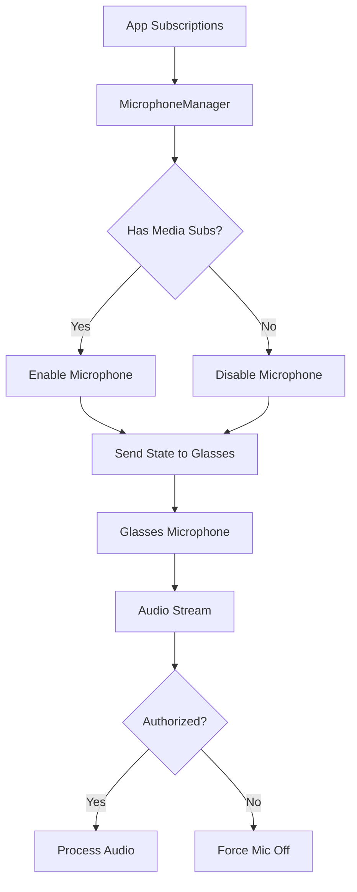

## Overview

MicrophoneManager controls the microphone state for a user session, managing when the smart glasses should capture and send audio. It implements intelligent debouncing, unauthorized audio detection, keep-alive mechanisms, and VAD (Voice Activity Detection) bypass for specific scenarios.

**File**: `packages/cloud/src/services/session/MicrophoneManager.ts`

## Key Features

1. **State Debouncing**: Prevents rapid microphone state changes
2. **Keep-Alive Mechanism**: Maintains microphone state during active sessions
3. **Unauthorized Audio Detection**: Turns off mic when receiving unexpected audio
4. **VAD Bypass Support**: Bypasses voice activity detection for PCM subscriptions
5. **Subscription-Based Control**: Automatically manages mic based on app needs
6. **Cached State Management**: Optimizes performance with subscription caching

## Architecture



## State Management

### Microphone State

```typescript
// Core state tracking
private enabled: boolean = false;
private lastSentState: boolean = false;
private lastSentRequiredData: Array<"pcm" | "transcription" | "pcm_or_transcription"> = [];

// Debounce mechanism
private debounceTimer: NodeJS.Timeout | null = null;
private pendingState: boolean | null = null;
private pendingRequiredData: Array<"pcm" | "transcription" | "pcm_or_transcription"> | null = null;
```

### State Update with Debouncing

```typescript
updateState(
  isEnabled: boolean,
  requiredData: Array<"pcm" | "transcription" | "pcm_or_transcription">,
  delay: number = 1000
): void {
  if (this.debounceTimer === null) {
    // First call: send immediately
    this.sendStateChangeToGlasses(isEnabled, requiredData);
    this.lastSentState = isEnabled;
    this.pendingState = isEnabled;
    this.lastSentRequiredData = Array.from(requiredData);
    this.pendingRequiredData = Array.from(requiredData);
    this.enabled = isEnabled;
  } else {
    // Subsequent calls: update pending state
    this.pendingState = isEnabled;
    this.pendingRequiredData = Array.from(requiredData);
    clearTimeout(this.debounceTimer);
    this.debounceTimer = null;
  }
  
  // Set debounce timer
  this.debounceTimer = setTimeout(() => {
    // Only send if state or required data changed
    if (this.pendingState !== this.lastSentState || 
        this.hasRequiredDataChanged(this.pendingRequiredData!, this.lastSentRequiredData!)) {
      this.sendStateChangeToGlasses(this.pendingState!, this.pendingRequiredData!);
      this.lastSentState = this.pendingState!;
      this.lastSentRequiredData = this.pendingRequiredData!;
      this.enabled = this.pendingState!;
    }
    
    this.updateKeepAliveTimer();
    this.debounceTimer = null;
    this.pendingState = null;
    this.pendingRequiredData = null;
  }, delay);
}
```

## Message Format

### Microphone State Change Message

```typescript
const message: MicrophoneStateChange = {
  type: CloudToGlassesMessageType.MICROPHONE_STATE_CHANGE,
  sessionId: this.session.sessionId,
  userSession: {
    sessionId: this.session.sessionId,
    userId: this.session.userId,
    startTime: this.session.startTime,
    activeAppSessions: Array.from(this.session.runningApps),
    loadingApps: this.session.loadingApps,
    isTranscribing: this.session.isTranscribing || false
  },
  isMicrophoneEnabled: isEnabled,
  requiredData: requiredData,
  bypassVad: shouldBypassVad,  // PCM subscriptions bypass VAD
  timestamp: new Date()
};
```

## Required Data Calculation

### Data Type Logic

```typescript
calculateRequiredData(
  hasPCM: boolean,
  hasTranscription: boolean
): Array<"pcm" | "transcription" | "pcm_or_transcription"> {
  const requiredData = [];
  const isCloudSttDown = this.session.transcriptionManager.isCloudSTTDown();
  
  if (hasPCM) {
    requiredData.push("pcm");
    if (hasTranscription && isCloudSttDown) {
      requiredData.push("transcription");
    }
  } else {
    if (hasTranscription && isCloudSttDown) {
      requiredData.push("transcription");
    } else {
      requiredData.push("pcm_or_transcription");
    }
  }
  
  return requiredData;
}
```

### VAD Bypass Logic

```typescript
private shouldBypassVadForPCM(): boolean {
  // Bypass VAD when apps need raw PCM data
  return this.cachedSubscriptionState.hasPCM;
}
```

## Subscription Management

### Cached Subscription State

```typescript
private cachedSubscriptionState: {
  hasPCM: boolean;
  hasTranscription: boolean;
  hasMedia: boolean;
} = {
  hasPCM: false,
  hasTranscription: false,
  hasMedia: false
};

private updateCachedSubscriptionState(): void {
  const state = subscriptionService.hasPCMTranscriptionSubscriptions(
    this.session.sessionId
  );
  this.cachedSubscriptionState = {
    hasPCM: state.hasPCM,
    hasTranscription: state.hasTranscription,
    hasMedia: state.hasMedia
  };
}
```

### Subscription Change Handler

```typescript
handleSubscriptionChange(): void {
  // Debounce rapid subscription changes
  if (this.subscriptionDebounceTimer) {
    clearTimeout(this.subscriptionDebounceTimer);
  }
  
  this.subscriptionDebounceTimer = setTimeout(() => {
    // Update cache and microphone state
    this.updateCachedSubscriptionState();
    
    const hasMediaSubscriptions = this.cachedSubscriptionState.hasMedia;
    const requiredData = this.calculateRequiredData(
      this.cachedSubscriptionState.hasPCM,
      this.cachedSubscriptionState.hasTranscription
    );
    
    this.updateState(hasMediaSubscriptions, requiredData);
    this.subscriptionDebounceTimer = null;
  }, 100);  // 100ms debounce
}
```

## Keep-Alive Mechanism

### Keep-Alive Timer

```typescript
private readonly KEEP_ALIVE_INTERVAL_MS = 10000;  // 10 seconds

private updateKeepAliveTimer(): void {
  const shouldHaveKeepAlive = this.enabled && this.cachedSubscriptionState.hasMedia;
  
  if (shouldHaveKeepAlive && !this.keepAliveTimer) {
    // Start keep-alive
    this.keepAliveTimer = setInterval(() => {
      if (this.session.websocket?.readyState === WebSocket.OPEN) {
        if (this.cachedSubscriptionState.hasMedia && this.enabled) {
          this.sendStateChangeToGlasses(
            this.lastSentState,
            this.lastSentRequiredData,
            true  // isKeepAlive
          );
        } else {
          this.stopKeepAliveTimer();
        }
      }
    }, this.KEEP_ALIVE_INTERVAL_MS);
  } else if (!shouldHaveKeepAlive && this.keepAliveTimer) {
    this.stopKeepAliveTimer();
  }
}
```

## Unauthorized Audio Detection

### Detection and Response

```typescript
private readonly UNAUTHORIZED_AUDIO_DEBOUNCE_MS = 5000;  // 5 seconds

onAudioReceived(): void {
  // Skip if in debounce period
  if (this.unauthorizedAudioTimer) {
    return;
  }
  
  // Check if we should NOT be receiving audio
  const shouldMicBeOff = !this.enabled || !this.cachedSubscriptionState.hasMedia;
  
  if (shouldMicBeOff) {
    this.logger.warn("Receiving unauthorized audio - forcing mic off");
    
    // Send mic off immediately
    const requiredData = this.calculateRequiredData(
      this.cachedSubscriptionState.hasPCM,
      this.cachedSubscriptionState.hasTranscription
    );
    this.sendStateChangeToGlasses(false, requiredData);
    
    // Update state
    this.enabled = false;
    this.lastSentState = false;
    this.lastSentRequiredData = requiredData;
    
    // Stop keep-alive
    this.stopKeepAliveTimer();
    
    // Start debounce timer
    this.unauthorizedAudioTimer = setTimeout(() => {
      this.updateCachedSubscriptionState();
      this.unauthorizedAudioTimer = null;
    }, this.UNAUTHORIZED_AUDIO_DEBOUNCE_MS);
  }
}
```

## Connection State Handling

```typescript
handleConnectionStateChange(status: string): void {
  if (status === "CONNECTED") {
    // Update cache when glasses connect
    this.updateCachedSubscriptionState();
    
    const hasMediaSubscriptions = this.cachedSubscriptionState.hasMedia;
    const requiredData = this.calculateRequiredData(
      this.cachedSubscriptionState.hasPCM,
      this.cachedSubscriptionState.hasTranscription
    );
    
    this.updateState(hasMediaSubscriptions, requiredData);
  }
}
```

## Integration Methods

### Current State Query

```typescript
isEnabled(): boolean {
  return this.enabled;
}
```

### Audio Reception Callback

Called by AudioManager when audio is received:

```typescript
// In AudioManager
this.userSession.microphoneManager.onAudioReceived();
```

## Configuration

### Timing Constants

```typescript
// Debounce delays
private readonly DEFAULT_DEBOUNCE_DELAY = 1000;        // 1 second
private readonly SUBSCRIPTION_DEBOUNCE_DELAY = 100;    // 100ms

// Keep-alive interval
private readonly KEEP_ALIVE_INTERVAL_MS = 10000;      // 10 seconds

// Unauthorized audio detection
private readonly UNAUTHORIZED_AUDIO_DEBOUNCE_MS = 5000; // 5 seconds
```

## Lifecycle Management

### Disposal

```typescript
dispose(): void {
  // Clear all timers
  if (this.debounceTimer) {
    clearTimeout(this.debounceTimer);
    this.debounceTimer = null;
  }
  
  if (this.subscriptionDebounceTimer) {
    clearTimeout(this.subscriptionDebounceTimer);
    this.subscriptionDebounceTimer = null;
  }
  
  this.stopKeepAliveTimer();
  this.stopUnauthorizedAudioTimer();
}
```

## Best Practices

1. **Always use debouncing** to prevent rapid state changes
2. **Cache subscription state** to avoid expensive repeated lookups
3. **Send keep-alive messages** to maintain microphone state
4. **Detect unauthorized audio** and respond immediately
5. **Bypass VAD** when apps need raw PCM data
6. **Update state on connection** to ensure sync with glasses

## Integration Points

- **AudioManager**: Notifies when audio is received
- **SubscriptionService**: Determines media subscription state
- **TranscriptionManager**: Provides cloud STT status
- **WebSocket**: Sends state changes to glasses
- **AppManager**: Updates on app subscription changes

## Related Documentation

- **[AudioManager](/cloud-architecture/managers/audio-manager)**: Audio processing
- **[SubscriptionService](/cloud-architecture/services/subscription-service)**: Subscription management
- **[Message Types](/cloud-overview/message-types)**: Microphone state messages
- **[WebSocket Service](/cloud-architecture/services/websocket-service)**: Connection handling