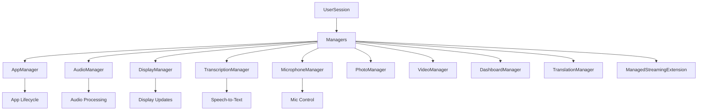

## Overview

MentraOS Cloud uses a Manager pattern to organize functionality within UserSessions. Each manager is responsible for a specific domain of functionality, encapsulating related state, logic, and operations. This pattern promotes separation of concerns, maintainability, and testability.

## Architecture



## Manager Characteristics

### Common Patterns

All managers follow these patterns:

1. **Constructor Pattern**
   ```typescript
   constructor(userSession: UserSession) {
     this.userSession = userSession;
     this.logger = userSession.logger.child({ manager: 'ManagerName' });
     // Initialize manager-specific state
   }
   ```

2. **Disposal Pattern**
   ```typescript
   dispose(): void {
     // Clear intervals/timeouts
     // Release resources
     // Clear event listeners
     // Reset state
   }
   ```

3. **Session Reference**
   - Each manager holds a reference to its parent UserSession
   - Allows access to other managers when needed
   - Provides context for operations

## Manager Categories

### 1. Hardware Managers

Managers that interface with smart glasses hardware:

- **[MicrophoneManager](/cloud-architecture/managers/microphone-manager)**: Controls microphone state and audio streaming
- **[DisplayManager](/cloud-architecture/managers/display-manager)**: Manages display updates with throttling
- **[PhotoManager](/cloud-architecture/managers/photo-manager)**: Handles photo capture requests
- **[VideoManager](/cloud-architecture/managers/video-manager)**: Manages video streaming

### 2. Processing Managers

Managers that process data streams:

- **[AudioManager](/cloud-architecture/managers/audio-manager)**: Buffers and routes audio data
- **[TranscriptionManager](/cloud-architecture/managers/transcription-manager)**: Converts speech to text
- **[TranslationManager](/cloud-architecture/managers/translation-manager)**: Translates text between languages
- **[DashboardManager](/cloud-architecture/managers/dashboard-manager)**: Generates dashboard displays

### 3. Control Managers

Managers that coordinate system behavior:

- **[AppManager](/cloud-architecture/managers/app-manager)**: Manages app lifecycle and connections
- **[ManagedStreamingExtension](/cloud-architecture/managers/managed-streaming)**: Handles RTMP streaming

## Manager Interactions

### Direct Communication

Managers can interact through the UserSession:

```typescript
// In AudioManager
processAudioData(data: ArrayBuffer) {
  // Process audio...
  
  // Trigger transcription if needed
  if (this.userSession.transcriptionManager.isActive()) {
    this.userSession.transcriptionManager.processAudio(data);
  }
}
```

### Event-Based Communication

Some managers use events for loose coupling:

```typescript
// In TranscriptionManager
onTranscriptionComplete(text: string) {
  // Emit event that other managers can listen to
  this.emit('transcription', { text, timestamp: Date.now() });
}
```

### Shared State

Managers access shared state through UserSession:

```typescript
// Check if apps are running
if (this.userSession.runningApps.size > 0) {
  // Perform app-specific logic
}
```

## Lifecycle Management

### Initialization

Managers are created when UserSession is instantiated:

```typescript
// In UserSession constructor
this.appManager = new AppManager(this);
this.audioManager = new AudioManager(this);
this.displayManager = new DisplayManager(this);
// ... other managers
```

### Active Operation

During session lifetime:
- Managers respond to incoming messages
- Process data streams
- Maintain internal state
- Coordinate with other managers

### Cleanup

When session ends, all managers are disposed:

```typescript
// In UserSession.dispose()
if (this.appManager) this.appManager.dispose();
if (this.audioManager) this.audioManager.dispose();
// ... dispose all managers
```

## Best Practices

### 1. Single Responsibility

Each manager should focus on one domain:
- ✅ AudioManager handles only audio
- ❌ AudioManager shouldn't manage display

### 2. Proper Resource Management

```typescript
class ExampleManager {
  private intervalId?: Timer;
  
  startProcessing() {
    this.intervalId = setInterval(() => {
      // Process...
    }, 1000);
  }
  
  dispose() {
    if (this.intervalId) {
      clearInterval(this.intervalId);
      this.intervalId = undefined;
    }
  }
}
```

### 3. Error Isolation

Errors in one manager shouldn't crash others:

```typescript
try {
  await this.performOperation();
} catch (error) {
  this.logger.error('Operation failed:', error);
  // Handle gracefully, don't propagate
}
```

### 4. Logging Context

Always use contextual logging:

```typescript
this.logger = userSession.logger.child({ 
  manager: 'AudioManager',
  userId: userSession.userId 
});
```

## Common Manager Methods

### State Queries

```typescript
isActive(): boolean
getStatus(): ManagerStatus
getCurrentState(): StateObject
```

### Configuration

```typescript
updateSettings(settings: ManagerSettings): void
setEnabled(enabled: boolean): void
```

### Data Processing

```typescript
processData(data: DataType): void
handleMessage(message: MessageType): void
```

### Cleanup

```typescript
dispose(): void
reset(): void
clearBuffers(): void
```

## Threading Considerations

- All managers run in the Bun runtime event loop
- Long operations should be async or use workers
- Avoid blocking operations
- Use timers for periodic tasks

## Testing Managers

Managers should be testable in isolation:

```typescript
// Mock UserSession for testing
const mockSession = {
  userId: 'test-user',
  logger: mockLogger,
  websocket: mockWebSocket,
  // ... other required properties
};

const manager = new AudioManager(mockSession);
// Test manager behavior
```

## Performance Guidelines

1. **Buffer Management**: Clear old data regularly
2. **Event Throttling**: Limit high-frequency events
3. **Resource Pooling**: Reuse expensive resources
4. **Lazy Initialization**: Create resources only when needed

## Manager Documentation

Each manager has detailed documentation:

- **[AppManager](/cloud-architecture/managers/app-manager)** - App lifecycle and connections
- **[AudioManager](/cloud-architecture/managers/audio-manager)** - Audio buffering and routing
- **[DisplayManager](/cloud-architecture/managers/display-manager)** - Display updates and throttling
- **[TranscriptionManager](/cloud-architecture/managers/transcription-manager)** - Speech-to-text processing
- **[MicrophoneManager](/cloud-architecture/managers/microphone-manager)** - Microphone state control
- **[PhotoManager](/cloud-architecture/managers/photo-manager)** - Photo capture handling
- **[VideoManager](/cloud-architecture/managers/video-manager)** - Video streaming
- **[DashboardManager](/cloud-architecture/managers/dashboard-manager)** - Dashboard generation
- **[TranslationManager](/cloud-architecture/managers/translation-manager)** - Language translation
- **[ManagedStreamingExtension](/cloud-architecture/managers/managed-streaming)** - RTMP streaming

## Related Documentation

- **[UserSession Class](/cloud-architecture/session-management/user-session-class)** - Parent container
- **[Session Lifecycle](/cloud-architecture/session-management/user-session-lifecycle)** - Manager lifecycle context
- **[Data Flow](/cloud-architecture/data-flow/overview)** - How data flows through managers