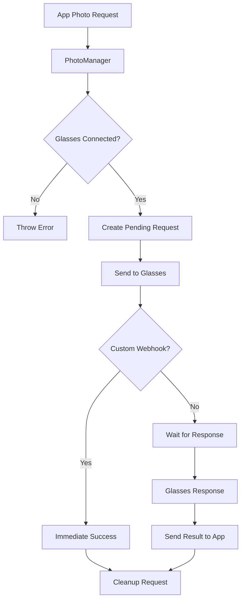

## Overview

PhotoManager handles photo capture requests within a user session. It manages the lifecycle of photo requests from apps, forwards them to smart glasses, handles responses, and supports both default and custom webhook URLs for photo uploads.

**File**: `packages/cloud/src/services/session/PhotoManager.ts`

## Key Features

1. **Photo Request Management**: Tracks pending photo requests with timeouts
2. **Webhook Support**: Handles both default and custom webhook URLs
3. **Gallery Integration**: Supports saving photos to device gallery
4. **Timeout Handling**: Automatic cleanup of stale requests
5. **App Communication**: Sends photo results back to requesting apps
6. **Session Lifecycle**: Cleans up pending requests on disposal

## Architecture



## Request Management

### Photo Request Structure

```typescript
interface PendingPhotoRequest {
  requestId: string;
  userId: string;
  timestamp: number;
  packageName: string;
  saveToGallery: boolean;
  timeoutId: NodeJS.Timeout;
}
```

### Request Processing

```typescript
async requestPhoto(appRequest: PhotoRequest): Promise<string> {
  const {
    packageName,
    requestId,
    saveToGallery = false,
    customWebhookUrl
  } = appRequest;
  
  // Determine webhook URL
  let webhookUrl: string | undefined;
  if (customWebhookUrl) {
    webhookUrl = customWebhookUrl;
  } else {
    const app = this.userSession.installedApps.get(packageName);
    webhookUrl = app?.publicUrl ? `${app.publicUrl}/photo-upload` : undefined;
  }
  
  // Validate connection
  if (!this.userSession.websocket || 
      this.userSession.websocket.readyState !== WebSocket.OPEN) {
    throw new Error("Glasses WebSocket not connected.");
  }
  
  // Create pending request
  const requestInfo: PendingPhotoRequest = {
    requestId,
    userId: this.userSession.userId,
    timestamp: Date.now(),
    packageName,
    saveToGallery,
    timeoutId: setTimeout(
      () => this._handlePhotoRequestTimeout(requestId),
      PHOTO_REQUEST_TIMEOUT_MS_DEFAULT
    )
  };
  
  this.pendingPhotoRequests.set(requestId, requestInfo);
  
  // Send to glasses
  const messageToGlasses = {
    type: CloudToGlassesMessageType.PHOTO_REQUEST,
    sessionId: this.userSession.sessionId,
    requestId,
    appId: packageName,
    webhookUrl,
    timestamp: new Date()
  };
  
  this.userSession.websocket.send(JSON.stringify(messageToGlasses));
  
  return requestId;
}
```

## Webhook Handling

### Custom Webhook Flow

When a custom webhook URL is provided:

```typescript
if (customWebhookUrl) {
  this.logger.info(
    { requestId },
    "Using custom webhook URL - resolving immediately"
  );
  
  // Clear timeout and pending request
  clearTimeout(requestInfo.timeoutId);
  this.pendingPhotoRequests.delete(requestId);
  
  // Send immediate success to app
  await this._sendPhotoResultToApp(requestInfo, {
    type: GlassesToCloudMessageType.PHOTO_RESPONSE,
    requestId,
    photoUrl: customWebhookUrl,
    savedToGallery: saveToGallery,
    timestamp: new Date()
  });
}
```

### Default Webhook

For apps without custom webhooks:

```typescript
const app = this.userSession.installedApps.get(packageName);
webhookUrl = app?.publicUrl ? `${app.publicUrl}/photo-upload` : undefined;
```

## Response Handling

### Photo Response Processing

```typescript
async handlePhotoResponse(glassesResponse: PhotoResponse): Promise<void> {
  const { requestId, photoUrl, savedToGallery } = glassesResponse;
  const pendingPhotoRequest = this.pendingPhotoRequests.get(requestId);
  
  if (!pendingPhotoRequest) {
    this.logger.warn(
      { requestId },
      "Received response for unknown or timed-out request"
    );
    return;
  }
  
  // Clear timeout and remove from pending
  clearTimeout(pendingPhotoRequest.timeoutId);
  this.pendingPhotoRequests.delete(requestId);
  
  // Send result to app
  await this._sendPhotoResultToApp(pendingPhotoRequest, glassesResponse);
}
```

### Result Distribution

```typescript
private async _sendPhotoResultToApp(
  pendingPhotoRequest: PendingPhotoRequest,
  photoResponse: PhotoResponse
): Promise<void> {
  const { requestId, packageName } = pendingPhotoRequest;
  
  // Use AppManager for reliable delivery with resurrection
  const result = await this.userSession.appManager.sendMessageToApp(
    packageName,
    photoResponse
  );
  
  if (result.sent) {
    this.logger.info({
      requestId,
      packageName,
      resurrectionTriggered: result.resurrectionTriggered
    }, `Sent photo result to App${result.resurrectionTriggered ? " after resurrection" : ""}`);
  } else {
    this.logger.warn({
      requestId,
      packageName,
      error: result.error
    }, "Failed to send photo result to App");
  }
}
```

## Timeout Management

### Timeout Handler

```typescript
private readonly PHOTO_REQUEST_TIMEOUT_MS_DEFAULT = 30000;  // 30 seconds

private _handlePhotoRequestTimeout(requestId: string): void {
  const requestInfo = this.pendingPhotoRequests.get(requestId);
  if (!requestInfo) return;
  
  this.logger.warn({
    requestId,
    packageName: requestInfo.packageName
  }, "Photo request timed out");
  
  this.pendingPhotoRequests.delete(requestId);
  
  // Note: Currently doesn't send error to app
  // TODO: Extend photo result to support error field
}
```

## Message Formats

### Request to Glasses

```typescript
{
  type: CloudToGlassesMessageType.PHOTO_REQUEST,
  sessionId: string,
  requestId: string,
  appId: string,        // Package name
  webhookUrl?: string,  // Upload destination
  timestamp: Date
}
```

### Response from Glasses

```typescript
interface PhotoResponse {
  type: GlassesToCloudMessageType.PHOTO_RESPONSE,
  requestId: string,
  photoUrl?: string,
  savedToGallery?: boolean,
  timestamp: Date
}
```

## Gallery Integration

Photos can be saved to the device gallery:

```typescript
// App request
{
  saveToGallery: true  // Request to save
}

// Glasses response
{
  savedToGallery: true  // Actual save status
}
```

## Lifecycle Management

### Disposal

```typescript
dispose(): void {
  this.logger.info("Disposing PhotoManager");
  
  // Cancel all pending requests
  this.pendingPhotoRequests.forEach((requestInfo, requestId) => {
    clearTimeout(requestInfo.timeoutId);
    // TODO: Send cancellation notice to apps
  });
  
  this.pendingPhotoRequests.clear();
}
```

## Error Handling

### Connection Validation

```typescript
if (!this.userSession.websocket || 
    this.userSession.websocket.readyState !== WebSocket.OPEN) {
  throw new Error("Glasses WebSocket not connected.");
}
```

### Unknown Request Handling

```typescript
if (!pendingPhotoRequest) {
  this.logger.warn(
    { requestId },
    "Received response for unknown request"
  );
  return;
}
```

## Best Practices

1. **Always validate WebSocket connection** before sending requests
2. **Use custom webhooks** for direct uploads when possible
3. **Set appropriate timeouts** based on network conditions
4. **Clean up pending requests** on session disposal
5. **Log all state transitions** for debugging
6. **Handle resurrection** when sending results to apps

## Future Enhancements

Current TODOs in the code:

1. **Error Response Support**: Extend photo result to include error field
2. **Cancellation Notices**: Send cancellation messages to apps on disposal
3. **Retry Logic**: Implement retry for failed photo requests
4. **Progress Updates**: Support progress notifications during upload

## Integration Points

- **AppManager**: Sends results to apps with resurrection support
- **WebSocket**: Communicates with smart glasses
- **Installed Apps**: Retrieves default webhook URLs
- **Message Types**: Uses SDK-defined message formats

## Related Documentation

- **[AppManager](/cloud-architecture/managers/app-manager)**: App communication
- **[Message Types](/cloud-overview/message-types)**: Photo request/response formats
- **[WebSocket Service](/cloud-architecture/services/websocket-service)**: Glasses connection
- **[SDK Integration](/cloud-overview/sdk-integration)**: App-side photo handling