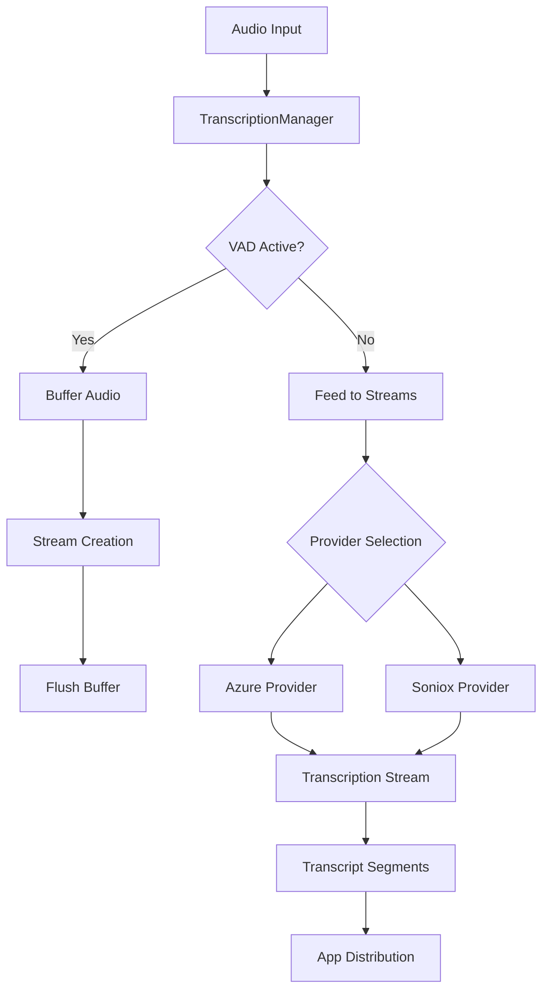

## Overview

TranscriptionManager handles all transcription-related functionality within a user session. It provides provider abstraction for multiple transcription services (Azure and Soniox), manages stream lifecycle, handles multi-language support, implements VAD (Voice Activity Detection) audio buffering, and maintains transcript history.

**File**: `packages/cloud/src/services/session/transcription/TranscriptionManager.ts`

## Key Features

1. **Provider Abstraction**: Supports Azure and Soniox transcription services
2. **Multi-Language Support**: Handles transcription for various languages
3. **VAD Audio Buffering**: Prevents speech loss during stream startup
4. **Automatic Provider Failover**: Falls back to alternative providers on failure
5. **Stream Health Monitoring**: Detects and replaces unhealthy streams
6. **Transcript History**: Maintains per-language transcript segments
7. **Local Transcription Support**: Can receive transcripts from device-side processing

## Architecture



## Provider Management

### Provider Configuration

```typescript
interface TranscriptionConfig {
  providers: {
    defaultProvider: ProviderType;
    fallbackProvider?: ProviderType;
  };
  azure: AzureTranscriptionConfig;
  soniox: SonioxTranscriptionConfig;
  retries: RetryConfig;
  performance: PerformanceConfig;
  limits: ResourceLimits;
}
```

### Provider Initialization

```typescript
private async initializeProviders(): Promise<void> {
  // Try Azure
  try {
    const azureProvider = new AzureTranscriptionProvider(
      this.config.azure,
      this.logger
    );
    await azureProvider.initialize();
    this.providers.set(ProviderType.AZURE, azureProvider);
  } catch (error) {
    this.logger.error(error, "Failed to initialize Azure provider");
  }
  
  // Try Soniox
  try {
    const sonioxProvider = new SonioxTranscriptionProvider(
      this.config.soniox,
      this.logger
    );
    await sonioxProvider.initialize();
    this.providers.set(ProviderType.SONIOX, sonioxProvider);
  } catch (error) {
    this.logger.error(error, "Failed to initialize Soniox provider");
  }
  
  // Initialize provider selector
  this.providerSelector = new ProviderSelector(
    this.providers,
    this.config,
    this.logger
  );
}
```

## Stream Lifecycle Management

### Subscription Updates

```typescript
async updateSubscriptions(subscriptions: ExtendedStreamType[]): Promise<void> {
  await this.ensureInitialized();
  
  // Filter out translation subscriptions (handled by TranslationManager)
  const validSubscriptions = subscriptions.filter(sub => {
    if (typeof sub === "string" && sub.startsWith("translation:")) {
      return false;
    }
    return true;
  });
  
  const desired = new Set(validSubscriptions);
  const current = new Set(this.streams.keys());
  
  // Stop removed streams
  for (const subscription of current) {
    if (!desired.has(subscription)) {
      await this.stopStream(subscription);
    }
  }
  
  // Start new streams
  for (const subscription of desired) {
    if (!current.has(subscription)) {
      await this.startStream(subscription);
    }
  }
  
  this.activeSubscriptions = desired;
}
```

### Stream Creation

```typescript
private async createStreamInstance(
  subscription: ExtendedStreamType,
  provider: TranscriptionProvider
): Promise<StreamInstance> {
  const languageInfo = getLanguageInfo(subscription)!;
  const streamId = this.generateStreamId(subscription);
  
  const callbacks = {
    onReady: () => this.logger.debug({ subscription }, "Stream ready"),
    onError: (error: Error) => this.handleStreamError(subscription, stream, error),
    onClosed: () => this.streams.delete(subscription),
    onData: (data: any) => this.relayDataToApps(subscription, data)
  };
  
  return await provider.createTranscriptionStream(
    languageInfo.transcribeLanguage,
    {
      streamId,
      userSession: this.userSession,
      subscription,
      callbacks
    }
  );
}
```

## VAD Audio Buffering

### Buffer Management

```typescript
// VAD buffer configuration
private vadAudioBuffer: ArrayBuffer[] = [];
private vadBufferMaxSize = 50;  // ~2.5 seconds at 50ms chunks
private isBufferingForVAD = false;
private vadBufferTimeout?: NodeJS.Timeout;
private vadBufferTimeoutMs = 10000;  // 10 second timeout
```

### Buffer Operations

```typescript
private startVADBuffering(): void {
  this.isBufferingForVAD = true;
  this.vadAudioBuffer = [];
  
  // Set timeout to automatically flush
  this.vadBufferTimeout = setTimeout(() => {
    this.logger.warn("VAD buffer timeout - force flushing");
    this.flushVADBuffer();
  }, this.vadBufferTimeoutMs);
}

private flushVADBuffer(): void {
  if (!this.isBufferingForVAD || this.vadAudioBuffer.length === 0) {
    return;
  }
  
  // Send all buffered chunks to streams
  for (const audioData of this.vadAudioBuffer) {
    this.feedAudioToStreams(audioData);
  }
  
  // Clear buffer
  this.vadAudioBuffer = [];
  this.isBufferingForVAD = false;
}
```

## Stream Health Management

### Health Checking

```typescript
private isStreamHealthy(stream: StreamInstance): boolean {
  if (stream.state === StreamState.ERROR || 
      stream.state === StreamState.CLOSED) {
    return false;
  }
  
  // Check provider health
  if (!stream.provider.isHealthy()) {
    return false;
  }
  
  // Check metrics
  if (stream.metrics.errorRate > 0.5 || 
      stream.metrics.consecutiveErrors > 3) {
    return false;
  }
  
  return true;
}
```

### Stream Recovery

```typescript
async ensureStreamsExist(): Promise<void> {
  const currentSubscriptions = Array.from(this.activeSubscriptions);
  
  // Clean up unhealthy streams
  for (const [subscription, stream] of this.streams.entries()) {
    if (!this.activeSubscriptions.has(subscription) || 
        !this.isStreamHealthy(stream)) {
      await this.cleanupStream(subscription, "unhealthy_stream");
    }
  }
  
  // Start VAD buffering for new streams
  this.startVADBuffering();
  
  // Create missing streams
  const createPromises = currentSubscriptions
    .filter(sub => !this.streams.has(sub))
    .map(sub => this.startStreamFast(sub));
  
  await Promise.allSettled(createPromises);
  
  // Flush buffered audio
  this.flushVADBuffer();
}
```

## Error Handling and Recovery

### Provider Failover

```typescript
private async handleStreamError(
  subscription: ExtendedStreamType,
  stream: StreamInstance | null,
  error: Error
): Promise<void> {
  const currentProvider = stream?.provider.name;
  
  // Record provider failure
  if (stream) {
    stream.provider.recordFailure(error);
  }
  
  // Clean up failed stream
  await this.cleanupStream(subscription, "provider_error");
  
  // Smart provider cycling
  if (currentProvider === ProviderType.SONIOX) {
    if (this.isSonioxRateLimit(error)) {
      // Rate limit - try Azure immediately
      if (await this.trySpecificProvider(subscription, ProviderType.AZURE)) {
        return;
      }
    }
  }
  
  // Schedule retry with backoff
  this.scheduleStreamRetry(subscription, attempts + 1, error);
}
```

## Transcript History

### History Management

```typescript
private transcriptHistory: {
  segments: TranscriptSegment[];  // Legacy en-US support
  languageSegments: Map<string, TranscriptSegment[]>;  // Multi-language
} = {
  segments: [],
  languageSegments: new Map()
};

private readonly HISTORY_RETENTION_MS = 30 * 60 * 1000;  // 30 minutes
private readonly HISTORY_PRUNE_INTERVAL_MS = 5 * 60 * 1000;  // Prune every 5 min
```

### History Pruning

```typescript
private startHistoryPruning(): void {
  this.historyPruneInterval = setInterval(() => {
    const cutoffTime = Date.now() - this.HISTORY_RETENTION_MS;
    
    // Prune legacy segments
    this.transcriptHistory.segments = this.transcriptHistory.segments
      .filter(segment => segment.timestamp > cutoffTime);
    
    // Prune language-specific segments
    for (const [lang, segments] of this.transcriptHistory.languageSegments) {
      const pruned = segments.filter(s => s.timestamp > cutoffTime);
      if (pruned.length === 0) {
        this.transcriptHistory.languageSegments.delete(lang);
      } else {
        this.transcriptHistory.languageSegments.set(lang, pruned);
      }
    }
  }, this.HISTORY_PRUNE_INTERVAL_MS);
}
```

## Local Transcription Support

```typescript
async handleLocalTranscription(message: LocalTranscription): Promise<void> {
  this.logger.debug({ message }, "Local transcription received");
  
  // Relay directly to apps (no provider needed)
  this.relayDataToApps(StreamType.TRANSCRIPTION, message);
}
```

## Integration Methods

### Audio Feed

```typescript
feedAudio(audioData: ArrayBuffer): void {
  // Buffer if VAD is starting up
  if (this.isBufferingForVAD) {
    this.vadAudioBuffer.push(audioData);
    
    // Prevent buffer overflow
    if (this.vadAudioBuffer.length > this.vadBufferMaxSize) {
      this.vadAudioBuffer.shift();
    }
    return;
  }
  
  // Normal feeding to streams
  this.feedAudioToStreams(audioData);
}
```

### Token Finalization

```typescript
finalizePendingTokens(): void {
  // Called when VAD stops - forces providers to send final transcriptions
  for (const [subscription, stream] of this.streams) {
    if (stream.provider.name === "soniox") {
      // Soniox buffers tokens - force finalization
      if ("forceFinalizePendingTokens" in stream) {
        (stream as any).forceFinalizePendingTokens();
      }
    }
    // Azure sends final results immediately
  }
}
```

## Metrics and Monitoring

```typescript
getMetrics(): Record<string, any> {
  return {
    totalStreams: this.streams.size,
    activeStreams: this.getActiveStreamCount(),
    byProvider: this.getStreamsByProvider(),
    byState: this.getStreamsByState(),
    vadBufferSize: this.vadAudioBuffer.length,
    isBuffering: this.isBufferingForVAD,
    historySize: {
      legacy: this.transcriptHistory.segments.length,
      languages: this.transcriptHistory.languageSegments.size
    }
  };
}
```

## Configuration

### Timing Constants

```typescript
// Stream creation timeout
private readonly DEFAULT_TIMEOUT_MS = 10000;  // 10 seconds
private readonly VAD_TIMEOUT_MS = 5000;       // 5 seconds for VAD

// Retry configuration
private readonly MAX_RETRY_ATTEMPTS = 3;
private readonly RETRY_BACKOFF_MS = 1000;

// Buffer limits
private readonly VAD_BUFFER_MAX_SIZE = 50;    // ~2.5 seconds
private readonly VAD_BUFFER_TIMEOUT_MS = 10000;  // 10 seconds
```

## Lifecycle Management

### Disposal

```typescript
async dispose(): Promise<void> {
  // Stop health monitoring
  if (this.healthCheckInterval) {
    clearInterval(this.healthCheckInterval);
  }
  
  // Stop history pruning
  if (this.historyPruneInterval) {
    clearInterval(this.historyPruneInterval);
  }
  
  // Close all streams
  await Promise.allSettled(
    Array.from(this.streams.values()).map(stream => stream.close())
  );
  
  // Dispose providers
  await Promise.allSettled(
    Array.from(this.providers.values()).map(provider => provider.dispose())
  );
  
  this.streams.clear();
  this.providers.clear();
}
```

## Best Practices

1. **Always buffer audio during VAD startup** to prevent speech loss
2. **Monitor stream health** and replace unhealthy streams automatically
3. **Use appropriate timeouts** - shorter for VAD scenarios
4. **Implement smart provider failover** based on error types
5. **Prune transcript history** to prevent memory growth
6. **Handle local transcription** for device-side processing

## Integration Points

- **AudioManager**: Receives audio data for transcription
- **TranslationManager**: Works in parallel for translation needs
- **SubscriptionService**: Determines which apps receive transcripts
- **Provider Classes**: Azure and Soniox implementations
- **VAD Detection**: Triggers stream lifecycle events

## Related Documentation

- **[AudioManager](/cloud-architecture/managers/audio-manager)**: Audio source
- **[TranslationManager](/cloud-architecture/managers/translation-manager)**: Translation services
- **[SubscriptionService](/cloud-architecture/services/subscription-service)**: App subscriptions
- **[Message Types](/cloud-overview/message-types)**: Transcript data formats