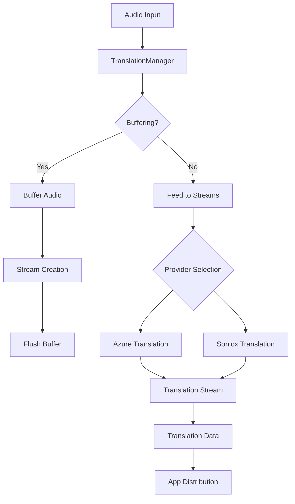

## Overview

TranslationManager handles real-time speech translation functionality within a user session. It provides provider abstraction for multiple translation services (Azure and Soniox), manages translation stream lifecycle independently from transcription, supports multi-language pairs, and implements audio buffering for seamless stream transitions.

**File**: `packages/cloud/src/services/session/translation/TranslationManager.ts`

## Key Features

1. **Provider Abstraction**: Supports Azure and Soniox translation services
2. **Independent Stream Management**: Translation streams separate from transcription
3. **Multi-Language Pair Support**: Handles various source-to-target language combinations
4. **Audio Buffering**: Prevents speech loss during stream startup
5. **Automatic Provider Failover**: Falls back to alternative providers on failure
6. **Stream Health Monitoring**: Detects and replaces unhealthy streams
7. **VAD-Aware Lifecycle**: Preserves subscriptions during VAD silence periods

## Architecture



## Subscription Management

### Subscription Format

Translation subscriptions follow the pattern: `translation:{source}-to-{target}`

Example: `translation:en-to-es` (English to Spanish)

### Subscription Updates

```typescript
async updateSubscriptions(subscriptions: ExtendedStreamType[]): Promise<void> {
  await this.ensureInitialized();
  
  // Filter to only translation subscriptions
  const translationSubscriptions = subscriptions.filter(sub => {
    if (typeof sub === "string" && sub.startsWith("translation:")) {
      // Validate not same-language translation
      const match = sub.match(/translation:([^-]+)-to-([^-]+)$/);
      if (match && match[1] === match[2]) {
        this.logger.warn("Filtering out same-language translation");
        return false;
      }
      return true;
    }
    return false;
  });
  
  const desired = new Set(translationSubscriptions);
  const current = new Set(this.streams.keys());
  
  // Stop removed streams
  for (const subscription of current) {
    if (!desired.has(subscription)) {
      await this.stopStream(subscription);
    }
  }
  
  // Start new streams
  for (const subscription of desired) {
    if (!current.has(subscription)) {
      await this.startStream(subscription);
    }
  }
  
  this.activeSubscriptions = desired;
}
```

## Stream Lifecycle Management

### Stream Creation

```typescript
private async createStreamInstance(
  subscription: ExtendedStreamType,
  provider: TranslationProvider
): Promise<TranslationStreamInstance> {
  const parsed = parseLanguageStream(subscription);
  
  const callbacks = {
    onReady: () => this.handleStreamReady(subscription),
    onError: (error: Error) => this.handleStreamError(subscription, stream, error),
    onClosed: () => this.handleStreamClosed(subscription),
    onData: (data: TranslationData) => this.handleTranslationData(subscription, data)
  };
  
  const options: TranslationStreamOptions = {
    streamId: this.generateStreamId(subscription),
    userSession: this.userSession,
    sourceLanguage: parsed.sourceLanguage,
    targetLanguage: parsed.targetLanguage,
    callbacks
  };
  
  return await provider.createTranslationStream(options);
}
```

### VAD-Aware Stream Management

```typescript
async stopAllStreams(): Promise<void> {
  // Stop all streams but preserve subscriptions for VAD resume
  this.logger.info("Stopping all translation streams (preserving subscriptions)");
  
  // Clear audio buffer
  this.clearAudioBuffer();
  
  // Close all streams
  const closePromises = Array.from(this.streams.values())
    .map(stream => stream.close());
  
  await Promise.allSettled(closePromises);
  
  // Clear streams but NOT activeSubscriptions
  this.streams.clear();
  
  this.logger.info({
    closedStreams: closePromises.length,
    preservedSubscriptions: this.activeSubscriptions.size
  }, "Streams stopped, subscriptions preserved for VAD resume");
}
```

## Audio Buffering

### Buffer Configuration

```typescript
// Audio buffer for stream startup
private audioBuffer: ArrayBuffer[] = [];
private audioBufferMaxSize = 50;  // ~2.5 seconds at 50ms chunks
private isBufferingAudio = false;
private audioBufferTimeout?: NodeJS.Timeout;
private audioBufferTimeoutMs = 10000;  // 10 second timeout
```

### Buffer Operations

```typescript
private startAudioBuffering(): void {
  this.isBufferingAudio = true;
  this.audioBuffer = [];
  
  // Set timeout to automatically flush
  this.audioBufferTimeout = setTimeout(() => {
    this.logger.warn("Audio buffer timeout - force flushing");
    this.flushAudioBuffer();
  }, this.audioBufferTimeoutMs);
}

private flushAudioBuffer(): void {
  if (!this.isBufferingAudio || this.audioBuffer.length === 0) {
    return;
  }
  
  // Send all buffered chunks to streams
  for (const audioData of this.audioBuffer) {
    this.feedAudioToStreams(audioData);
  }
  
  // Clear buffer
  this.audioBuffer = [];
  this.isBufferingAudio = false;
}
```

## Provider Management

### Provider Initialization

```typescript
private async initializeProviders(): Promise<void> {
  const availableProviders: TranslationProviderType[] = [];
  
  // Try Azure
  try {
    const { AzureTranslationProvider } = await import(
      "./providers/AzureTranslationProvider"
    );
    const azureProvider = new AzureTranslationProvider(
      this.config.azure,
      this.logger
    );
    await azureProvider.initialize();
    this.providers.set(TranslationProviderType.AZURE, azureProvider);
    availableProviders.push(TranslationProviderType.AZURE);
  } catch (error) {
    this.logger.error(error, "Failed to initialize Azure translation");
  }
  
  // Try Soniox
  try {
    const { SonioxTranslationProvider } = await import(
      "./providers/SonioxTranslationProvider"
    );
    const sonioxProvider = new SonioxTranslationProvider(
      this.config.soniox,
      this.logger
    );
    await sonioxProvider.initialize();
    this.providers.set(TranslationProviderType.SONIOX, sonioxProvider);
    availableProviders.push(TranslationProviderType.SONIOX);
  } catch (error) {
    this.logger.error(error, "Failed to initialize Soniox translation");
  }
  
  if (this.providers.size === 0) {
    throw new Error("No translation providers available");
  }
  
  this.isInitialized = true;
}
```

### Provider Selection

```typescript
private selectProvider(
  subscription: ExtendedStreamType
): TranslationProvider {
  // Get available healthy providers
  const healthyProviders = Array.from(this.providers.entries())
    .filter(([_, provider]) => provider.isHealthy())
    .map(([type, provider]) => ({ type, provider }));
  
  if (healthyProviders.length === 0) {
    throw new Error("No healthy translation providers available");
  }
  
  // Prefer default provider if healthy
  const defaultProvider = healthyProviders.find(
    p => p.type === this.config.providers.defaultProvider
  );
  
  if (defaultProvider) {
    return defaultProvider.provider;
  }
  
  // Use first healthy provider
  return healthyProviders[0].provider;
}
```

## Stream Health Management

### Health Checking

```typescript
private isStreamHealthy(stream: TranslationStreamInstance): boolean {
  // Check stream state
  if (stream.state === TranslationStreamState.ERROR || 
      stream.state === TranslationStreamState.CLOSED) {
    return false;
  }
  
  // Check provider health
  if (!stream.provider.isHealthy()) {
    return false;
  }
  
  // Check metrics
  if (stream.metrics.errorCount > 5 || 
      stream.metrics.lastDataTime < Date.now() - 30000) {
    return false;
  }
  
  return true;
}
```

### Stream Synchronization

```typescript
async ensureStreamsExist(): Promise<void> {
  const currentSubscriptions = Array.from(this.activeSubscriptions);
  
  // Clean up unhealthy or unwanted streams
  const streamsToCleanup = [];
  for (const [subscription, stream] of this.streams.entries()) {
    if (!this.activeSubscriptions.has(subscription) || 
        !this.isStreamHealthy(stream)) {
      streamsToCleanup.push(subscription);
    }
  }
  
  // Cleanup unhealthy streams
  for (const subscription of streamsToCleanup) {
    await this.cleanupStream(subscription, "unhealthy_stream");
  }
  
  // Start audio buffering
  this.startAudioBuffering();
  
  // Create missing streams
  const createPromises = currentSubscriptions
    .filter(sub => !this.streams.has(sub))
    .map(sub => this.startStream(sub));
  
  await Promise.allSettled(createPromises);
  
  // Flush buffered audio
  this.flushAudioBuffer();
}
```

## Data Distribution

### Translation Data Relay

```typescript
private async handleTranslationData(
  subscription: ExtendedStreamType,
  data: TranslationData
): Promise<void> {
  // Format data for SDK
  const formattedData: DataStream = {
    type: CloudToAppMessageType.DATA_STREAM,
    data,
    timestamp: new Date()
  };
  
  // Relay to subscribed apps
  await this.relayDataToApps(subscription, formattedData);
}

private async relayDataToApps(
  subscription: ExtendedStreamType,
  data: DataStream
): Promise<void> {
  const subscribedPackageNames = subscriptionService.getSubscribedApps(
    this.userSession,
    subscription
  );
  
  for (const packageName of subscribedPackageNames) {
    const connection = this.userSession.appConnections.get(packageName);
    if (connection?.readyState === WebSocket.OPEN) {
      try {
        connection.send(JSON.stringify(data));
      } catch (error) {
        this.logger.error({
          packageName,
          subscription,
          error
        }, "Error sending translation data to app");
      }
    }
  }
}
```

## Audio Feed Integration

```typescript
feedAudio(audioData: ArrayBuffer): void {
  // Buffer if starting up
  if (this.isBufferingAudio) {
    this.audioBuffer.push(audioData);
    
    // Prevent overflow
    if (this.audioBuffer.length > this.audioBufferMaxSize) {
      this.audioBuffer.shift();
    }
    return;
  }
  
  // Feed to active streams
  this.feedAudioToStreams(audioData);
}

private feedAudioToStreams(audioData: ArrayBuffer): void {
  if (!this.isInitialized || this.streams.size === 0) {
    return;
  }
  
  for (const [subscription, stream] of this.streams) {
    try {
      stream.writeAudio(audioData);
    } catch (error) {
      this.logger.warn({
        subscription,
        error,
        streamId: stream.id
      }, "Error feeding audio to translation stream");
    }
  }
}
```

## Metrics and Monitoring

```typescript
getMetrics(): Record<string, any> {
  const metrics = {
    totalStreams: this.streams.size,
    activeStreams: 0,
    byProvider: {} as Record<string, number>,
    byState: {} as Record<string, number>,
    byLanguagePair: {} as Record<string, number>
  };
  
  for (const stream of this.streams.values()) {
    // By provider
    const providerName = stream.provider.name;
    metrics.byProvider[providerName] = 
      (metrics.byProvider[providerName] || 0) + 1;
    
    // By state
    metrics.byState[stream.state] = 
      (metrics.byState[stream.state] || 0) + 1;
    
    // By language pair
    const pair = `${stream.sourceLanguage}->${stream.targetLanguage}`;
    metrics.byLanguagePair[pair] = 
      (metrics.byLanguagePair[pair] || 0) + 1;
    
    // Active count
    if (stream.state === TranslationStreamState.READY ||
        stream.state === TranslationStreamState.ACTIVE) {
      metrics.activeStreams++;
    }
  }
  
  return metrics;
}
```

## Configuration

### Timing Constants

```typescript
// Stream timeouts
private readonly STREAM_TIMEOUT_MS = 10000;     // 10 seconds
private readonly HEALTH_CHECK_INTERVAL = 30000; // 30 seconds

// Buffer configuration
private readonly AUDIO_BUFFER_MAX_SIZE = 50;    // ~2.5 seconds
private readonly AUDIO_BUFFER_TIMEOUT_MS = 10000; // 10 seconds

// Retry configuration
private readonly MAX_RETRY_ATTEMPTS = 3;
private readonly RETRY_BACKOFF_MS = 1000;
```

## Lifecycle Management

### Disposal

```typescript
async dispose(): Promise<void> {
  // Stop health monitoring
  if (this.healthCheckInterval) {
    clearInterval(this.healthCheckInterval);
  }
  
  // Clear audio buffer
  this.clearAudioBuffer();
  
  // Close all streams
  await Promise.allSettled(
    Array.from(this.streams.values()).map(stream => stream.close())
  );
  
  // Dispose providers
  await Promise.allSettled(
    Array.from(this.providers.values()).map(provider => provider.dispose())
  );
  
  this.streams.clear();
  this.providers.clear();
}
```

## Best Practices

1. **Always buffer audio during stream startup** to prevent speech loss
2. **Monitor stream health** and replace unhealthy streams automatically
3. **Preserve subscriptions during VAD silence** for quick resume
4. **Validate language pairs** to prevent same-language translation
5. **Use appropriate providers** based on language support
6. **Handle provider failures gracefully** with automatic failover

## Integration Points

- **AudioManager**: Receives audio data for translation
- **TranscriptionManager**: Works in parallel for transcription
- **SubscriptionService**: Determines which apps receive translations
- **Provider Classes**: Azure and Soniox implementations
- **VAD Detection**: Triggers stream lifecycle events

## Related Documentation

- **[AudioManager](/cloud-architecture/managers/audio-manager)**: Audio source
- **[TranscriptionManager](/cloud-architecture/managers/transcription-manager)**: Parallel transcription
- **[SubscriptionService](/cloud-architecture/services/subscription-service)**: App subscriptions
- **[Message Types](/cloud-overview/message-types)**: Translation data formats