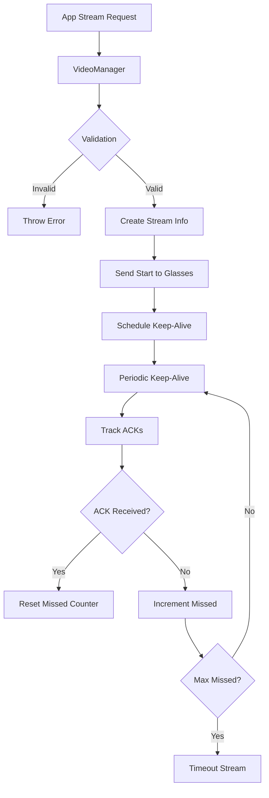

## Overview

VideoManager handles RTMP (Real-Time Messaging Protocol) streaming within a user session. It manages the lifecycle of video streams, tracks stream health through keep-alive mechanisms, handles acknowledgments, and ensures reliable communication between apps and smart glasses for video streaming.

**File**: `packages/cloud/src/services/session/VideoManager.ts`

## Key Features

1. **Stream Lifecycle Management**: Tracks streams from initialization to termination
2. **Keep-Alive Mechanism**: Maintains stream health with periodic heartbeats
3. **ACK Tracking**: Monitors acknowledgments to detect connection issues
4. **Conflict Management**: Prevents conflicts with managed streaming sessions
5. **Multi-Stream Support**: Handles multiple concurrent streams per session
6. **Status Broadcasting**: Notifies apps of stream status changes
7. **Timeout Detection**: Automatically cleans up stale streams

## Architecture



## Stream Management

### Stream Information Structure

```typescript
interface SessionStreamInfo {
  streamId: string;
  packageName: string;
  rtmpUrl: string;
  status: 'initializing' | 'active' | 'stopping' | 'stopped' | 'timeout';
  startTime: Date;
  lastKeepAlive: Date;
  keepAliveTimer?: NodeJS.Timeout;
  pendingAcks: Map<string, { sentAt: Date; timeout: NodeJS.Timeout; }>;
  missedAcks: number;
  options: {
    video?: VideoConfig;
    audio?: AudioConfig;
    stream?: StreamConfig;
  };
}
```

### Stream Creation

```typescript
async startRtmpStream(request: RtmpStreamRequest): Promise<string> {
  const { packageName, rtmpUrl, video, audio, stream: streamOptions } = request;
  
  // Validation
  if (!this.userSession.appManager.isAppRunning(packageName)) {
    throw new Error(`App ${packageName} is not running`);
  }
  if (!rtmpUrl || (!rtmpUrl.startsWith('rtmp://') && !rtmpUrl.startsWith('rtmps://'))) {
    throw new Error('Invalid RTMP URL');
  }
  if (!this.userSession.websocket?.readyState === WebSocket.OPEN) {
    throw new Error('Glasses WebSocket not connected');
  }
  
  // Check for managed stream conflicts
  if (this.userSession.managedStreamingExtension.checkUnmanagedStreamConflict(this.userSession.userId)) {
    throw new Error('Cannot start unmanaged stream - managed stream already active');
  }
  
  // Generate short ID for BLE efficiency
  const streamId = `s${Date.now().toString(36).slice(-6)}${Math.random().toString(36).slice(2, 6)}`;
  
  // Stop existing streams for this app
  this.stopStreamsByPackageName(packageName);
  
  // Create stream info
  const streamInfo: SessionStreamInfo = {
    streamId,
    packageName,
    rtmpUrl,
    status: 'initializing',
    startTime: now,
    lastKeepAlive: now,
    pendingAcks: new Map(),
    missedAcks: 0,
    options: { video, audio, stream: streamOptions }
  };
  
  this.activeSessionStreams.set(streamId, streamInfo);
  this.scheduleKeepAlive(streamId);
  
  // Send start command
  const startMessage: StartRtmpStream = {
    type: CloudToGlassesMessageType.START_RTMP_STREAM,
    sessionId: this.userSession.sessionId,
    rtmpUrl,
    appId: packageName,
    streamId,
    video: video || {},
    audio: audio || {},
    stream: streamOptions || {},
    timestamp: now
  };
  
  this.userSession.websocket.send(JSON.stringify(startMessage));
  return streamId;
}
```

## Keep-Alive Mechanism

### Keep-Alive Configuration

```typescript
const KEEP_ALIVE_INTERVAL_MS = 15000;  // 15 seconds
const STREAM_TIMEOUT_MS = 60000;       // 60 seconds
const ACK_TIMEOUT_MS = 5000;           // 5 seconds
const MAX_MISSED_ACKS = 3;             // Max consecutive missed ACKs
```

### Keep-Alive Scheduling

```typescript
private scheduleKeepAlive(streamId: string): void {
  const stream = this.activeSessionStreams.get(streamId);
  if (!stream) return;
  
  // Cancel existing timer
  if (stream.keepAliveTimer) {
    clearInterval(stream.keepAliveTimer);
  }
  
  // Schedule periodic keep-alive
  stream.keepAliveTimer = setInterval(() => {
    this.sendKeepAlive(streamId);
  }, KEEP_ALIVE_INTERVAL_MS);
}
```

### Keep-Alive Message

```typescript
private sendKeepAlive(streamId: string): void {
  const stream = this.activeSessionStreams.get(streamId);
  if (!stream) return;
  
  // Check stream status
  if (!['initializing', 'active'].includes(stream.status)) {
    this.stopTracking(streamId);
    return;
  }
  
  // Check timeout
  const timeSinceLastActivity = Date.now() - stream.lastKeepAlive.getTime();
  if (timeSinceLastActivity > STREAM_TIMEOUT_MS) {
    this.updateStatus(streamId, 'timeout');
    return;
  }
  
  // Generate short ACK ID for BLE
  const ackId = `a${Date.now().toString(36).slice(-5)}`;
  this.trackKeepAliveAck(streamId, ackId);
  
  // Send minimal keep-alive message
  const keepAliveMsg: KeepRtmpStreamAlive = {
    type: CloudToGlassesMessageType.KEEP_RTMP_STREAM_ALIVE,
    streamId,
    ackId
  };
  
  this.userSession.websocket.send(JSON.stringify(keepAliveMsg));
}
```

## ACK Tracking

### ACK Management

```typescript
private trackKeepAliveAck(streamId: string, ackId: string): void {
  const stream = this.activeSessionStreams.get(streamId);
  if (!stream) return;
  
  const timeout = setTimeout(() => {
    this.handleMissedKeepAliveAck(streamId, ackId);
  }, ACK_TIMEOUT_MS);
  
  stream.pendingAcks.set(ackId, {
    sentAt: new Date(),
    timeout
  });
}

handleKeepAliveAck(ackMessage: KeepAliveAck): void {
  const { streamId, ackId } = ackMessage;
  const stream = this.activeSessionStreams.get(streamId);
  if (!stream) return;
  
  const pendingAck = stream.pendingAcks.get(ackId);
  if (pendingAck) {
    clearTimeout(pendingAck.timeout);
    stream.pendingAcks.delete(ackId);
    stream.missedAcks = 0;  // Reset on successful ACK
    stream.lastKeepAlive = new Date();
  }
}
```

### Missed ACK Handling

```typescript
private handleMissedKeepAliveAck(streamId: string, ackId: string): void {
  const stream = this.activeSessionStreams.get(streamId);
  if (!stream) return;
  
  if (stream.pendingAcks.has(ackId)) {
    stream.pendingAcks.delete(ackId);
    stream.missedAcks++;
    
    if (stream.missedAcks >= MAX_MISSED_ACKS) {
      this.logger.error({ streamId, missedAcks: stream.missedAcks }, 
        'Too many missed ACKs, timing out stream');
      this.updateStatus(streamId, 'timeout');
    }
  }
}
```

## Status Management

### Status Updates from Glasses

```typescript
handleRtmpStreamStatus(statusMessage: RtmpStreamStatus): void {
  const { streamId, status } = statusMessage;
  const stream = this.activeSessionStreams.get(streamId);
  if (!stream) return;
  
  // Update activity time
  stream.lastKeepAlive = new Date();
  
  // Map glasses status to internal status
  let mappedStatus: SessionStreamInfo['status'];
  switch (status) {
    case 'initializing':
    case 'connecting':
    case 'reconnecting':
      mappedStatus = 'initializing';
      break;
    case 'active':
    case 'streaming':
      mappedStatus = 'active';
      break;
    case 'stopping':
      mappedStatus = 'stopping';
      break;
    case 'stopped':
    case 'disconnected':
      mappedStatus = 'stopped';
      break;
    case 'error':
    case 'timeout':
      mappedStatus = 'timeout';
      break;
    default:
      return;  // Ignore unknown statuses
  }
  
  this.updateStatus(streamId, mappedStatus);
}
```

### Status Broadcasting

```typescript
private async sendStreamStatusToApp(
  streamId: string,
  status: RtmpStreamStatus['status'],
  errorDetails?: string,
  stats?: RtmpStreamStatus['stats']
): Promise<void> {
  const streamInfo = this.activeSessionStreams.get(streamId);
  const packageName = streamInfo ? streamInfo.packageName : "unknown_package_owner";
  
  // Direct message to owning app
  const appOwnerMessage = {
    type: CloudToAppMessageType.RTMP_STREAM_STATUS,
    sessionId: `${this.userSession.sessionId}-${packageName}`,
    streamId,
    status,
    errorDetails,
    stats,
    appId: packageName,
    timestamp: new Date()
  };
  
  // Send using AppManager for resurrection support
  const result = await this.userSession.appManager.sendMessageToApp(
    packageName, 
    appOwnerMessage
  );
  
  // Broadcast to other subscribed apps
  const broadcastPayload: RtmpStreamStatus = {
    type: GlassesToCloudMessageType.RTMP_STREAM_STATUS,
    sessionId: this.userSession.sessionId,
    streamId,
    status,
    errorDetails,
    appId: packageName,
    stats,
    timestamp: new Date()
  };
  
  sessionService.relayMessageToApps(this.userSession, broadcastPayload);
}
```

## Stream Termination

### Stop Stream Request

```typescript
async stopRtmpStream(request: RtmpStreamStopRequest): Promise<void> {
  const { packageName, streamId } = request;
  
  if (streamId) {
    // Stop specific stream
    const stream = this.activeSessionStreams.get(streamId);
    if (stream && stream.packageName === packageName) {
      this.updateStatus(streamId, 'stopped');
    } else if (stream) {
      throw new Error(`App ${packageName} cannot stop stream owned by ${stream.packageName}`);
    }
  } else {
    // Stop all streams for this package
    this.stopStreamsByPackageName(packageName);
  }
  
  // Send stop command to glasses
  if (this.userSession.websocket?.readyState === WebSocket.OPEN) {
    const stopMessage: StopRtmpStream = {
      type: CloudToGlassesMessageType.STOP_RTMP_STREAM,
      sessionId: this.userSession.sessionId,
      appId: packageName,
      streamId: streamId || '',
      timestamp: new Date()
    };
    
    this.userSession.websocket.send(JSON.stringify(stopMessage));
  }
}
```

### Resource Cleanup

```typescript
stopTracking(streamId: string): void {
  const stream = this.activeSessionStreams.get(streamId);
  if (!stream) return;
  
  // Cancel keep-alive timer
  if (stream.keepAliveTimer) {
    clearInterval(stream.keepAliveTimer);
  }
  
  // Cancel all pending ACK timeouts
  for (const [, ackInfo] of stream.pendingAcks) {
    clearTimeout(ackInfo.timeout);
  }
  stream.pendingAcks.clear();
  
  this.activeSessionStreams.delete(streamId);
}
```

## Configuration Options

### Video Configuration

```typescript
interface VideoConfig {
  width?: number;
  height?: number;
  bitrate?: number;
  fps?: number;
  codec?: string;
}
```

### Audio Configuration

```typescript
interface AudioConfig {
  sampleRate?: number;
  channels?: number;
  bitrate?: number;
  codec?: string;
}
```

### Stream Configuration

```typescript
interface StreamConfig {
  reconnectAttempts?: number;
  reconnectDelay?: number;
  bufferSize?: number;
}
```

## Lifecycle Management

### Disposal

```typescript
dispose(): void {
  this.logger.info('Disposing VideoManager');
  
  // Stop all active streams
  const streamIdsToStop = Array.from(this.activeSessionStreams.keys());
  streamIdsToStop.forEach(streamId => {
    this.stopTracking(streamId);
  });
  
  this.activeSessionStreams.clear();
}
```

## Best Practices

1. **Use short IDs** for BLE efficiency (streamId, ackId)
2. **Validate RTMP URLs** before attempting connection
3. **Check for conflicts** with managed streaming sessions
4. **Stop existing streams** when starting new ones for same app
5. **Monitor ACKs closely** to detect connection issues early
6. **Clean up resources** properly on stream termination
7. **Broadcast status changes** to keep apps informed

## Integration Points

- **AppManager**: Validates app state and sends messages
- **ManagedStreamingExtension**: Checks for streaming conflicts
- **WebSocket**: Communicates with smart glasses
- **SessionService**: Broadcasts status to subscribed apps

## Related Documentation

- **[AppManager](/cloud-architecture/managers/app-manager)**: App state management
- **[ManagedStreamingExtension](/cloud-architecture/managers/managed-streaming-extension)**: Managed streaming
- **[Message Types](/cloud-overview/message-types)**: RTMP message formats
- **[WebSocket Service](/cloud-architecture/services/websocket-service)**: Glasses connection