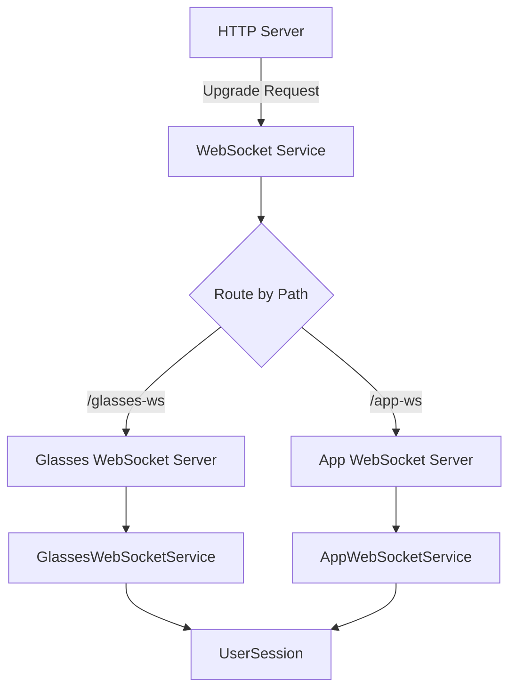

## Overview

The WebSocket Service is the central hub for all real-time communication in MentraOS Cloud. It manages two separate WebSocket servers - one for smart glasses connections and another for third-party app connections.

**File**: `packages/cloud/src/services/websocket/websocket.service.ts`

## Architecture



## Key Components

### Singleton Pattern

The service implements a singleton pattern to ensure only one instance manages all WebSocket connections:

```typescript
export class WebSocketService {
  private static instance: WebSocketService;
  
  private constructor() {
    this.glassesWss = new WebSocket.Server({ noServer: true });
    this.appWss = new WebSocket.Server({ noServer: true });
    // ... initialization
  }
  
  public static getInstance(): WebSocketService {
    if (!WebSocketService.instance) {
      WebSocketService.instance = new WebSocketService();
    }
    return WebSocketService.instance;
  }
}
```

### Connection Routing

The service handles HTTP upgrade requests and routes them based on the URL path:

1. **`/glasses-ws`** - Routes to glasses WebSocket handler
2. **`/app-ws`** - Routes to app WebSocket handler
3. **Unknown paths** - Rejects connection

## Authentication Flow

### Glasses Authentication

For glasses connections (`/glasses-ws`):

1. **Token Extraction**: JWT token from Authorization header
2. **Token Verification**: Using `AUGMENTOS_AUTH_JWT_SECRET`
3. **User ID Extraction**: From JWT payload (`userData.email`)
4. **Request Enhancement**: Attaches `userId` to request object

```typescript
// Extract JWT token from Authorization header
const coreToken = request.headers.authorization?.split(' ')[1];

// Verify the JWT token
const userData = jwt.verify(coreToken, AUGMENTOS_AUTH_JWT_SECRET);
const userId = (userData as JwtPayload).email;

// Attach userId to request
(request as any).userId = userId;
```

### App Authentication

For app connections (`/app-ws`):

1. **JWT Authentication** (preferred):
   - Bearer token in Authorization header
   - Headers: `x-user-id` and `x-session-id` required
   - JWT payload contains `packageName` and `apiKey`

2. **Request Enhancement**: Attaches to request:
   - `userId` - From x-user-id header
   - `sessionId` - From x-session-id header  
   - `appJwtPayload` - Decoded JWT payload

## Connection Handlers

### Glasses Connection Handler

```typescript
this.glassesWss.on('connection', (ws, request) => {
  logger.info('New glasses WebSocket connection established');
  this.glassesHandler.handleConnection(ws, request).catch(error => {
    logger.error(error,'Error handling glasses connection');
  });
});
```

### App Connection Handler

```typescript
this.appWss.on('connection', (ws, request) => {
  logger.info('New App WebSocket connection established');
  this.appHandler.handleConnection(ws, request).catch(error => {
    logger.error({ error }, 'Error handling App connection');
  });
});
```

## App Lifecycle Messages

The service provides methods to notify glasses when apps start or stop:

### sendAppStarted

Notifies glasses when an app begins running:

```typescript
public sendAppStarted(userSession: UserSession, packageName: string) {
  if (userSession.websocket && userSession.websocket.readyState === 1) {
    const appStartedMessage = {
      type: 'app_started',
      packageName: packageName,
      timestamp: new Date()
    };
    userSession.websocket.send(JSON.stringify(appStartedMessage));
  }
}
```

### sendAppStopped

Notifies glasses when an app stops:

```typescript
public sendAppStopped(userSession: UserSession, packageName: string) {
  if (userSession.websocket && userSession.websocket.readyState === 1) {
    const appStoppedMessage = {
      type: 'app_stopped',
      packageName: packageName,
      timestamp: new Date()
    };
    userSession.websocket.send(JSON.stringify(appStoppedMessage));
  }
}
```

## Error Handling

### Authentication Errors

For glasses connections:
```json
{
  "type": "CONNECTION_ERROR",
  "message": "Invalid core token",
  "timestamp": "2024-01-20T10:30:00Z"
}
```

For app connections:
```json
{
  "type": "tpa_connection_error",
  "code": "JWT_INVALID",
  "message": "Invalid JWT token: jwt malformed",
  "timestamp": "2024-01-20T10:30:00Z"
}
```

### HTTP Response Codes

- **401 Unauthorized**: Invalid or missing authentication
- **Connection closed**: Unknown WebSocket path

## Server Setup

The service attaches to an HTTP server using the `setupWebSocketServers` method:

```typescript
setupWebSocketServers(server: Server): void {
  server.on('upgrade', (request, socket, head) => {
    // Handle upgrade requests
  });
}
```

## Logging

Comprehensive logging includes:
- Connection attempts with headers and paths
- Authentication success/failure
- Connection establishment
- Message sending status
- Error details with stack traces

## Environment Variables

- **`AUGMENTOS_AUTH_JWT_SECRET`**: Secret key for JWT token verification (required)

## Best Practices

1. **Connection State Checks**: Always verify WebSocket readyState before sending
2. **Error Handling**: Catch and log all handler errors
3. **Token Security**: Never log full tokens, only first 10 characters
4. **Request Enhancement**: Attach authentication data to request for downstream handlers

## Related Services

- **[GlassesWebSocketService](/cloud-architecture/services/glasses-websocket-service)**: Handles glasses-specific logic
- **[AppWebSocketService](/cloud-architecture/services/app-websocket-service)**: Handles app-specific logic
- **[SessionService](/cloud-architecture/services/session-service)**: Manages user sessions
- **[UserSession](/cloud-architecture/session-management/user-session-class)**: Core session object