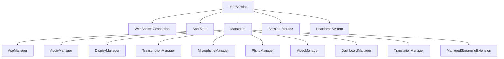

## Overview

The UserSession class is the central object that represents an active user connection in MentraOS Cloud. It encapsulates all session-related state, managers, and functionality for a single user, serving as the hub for all user interactions.

**File**: `packages/cloud/src/services/session/UserSession.ts`

## Architecture



## Core Properties

### Identification and State

```typescript
public readonly userId: string;              // User email (unique identifier)
public readonly startTime: Date;             // Session creation time
public disconnectedAt: Date | null = null;   // Disconnection timestamp
public readonly logger: Logger;              // Session-specific logger

// WebSocket connections
public websocket: WebSocket;                           // Glasses connection
public appWebsockets: Map<string, WebSocket> = new Map(); // App connections

// App state
public installedApps: Map<string, AppI> = new Map();   // All installed apps
public runningApps: Set<string> = new Set();           // Currently active apps
public loadingApps: Set<string> = new Set();           // Apps being started

// Hardware info
public capabilities: Capabilities | null = null;       // Device capabilities
public currentGlassesModel: string | null = null;      // Connected device model
```

### Manager Instances

Each UserSession contains dedicated manager instances:

```typescript
public displayManager: DisplayManager;              // Display updates
public dashboardManager: DashboardManager;          // Dashboard rendering
public microphoneManager: MicrophoneManager;        // Microphone control
public appManager: AppManager;                      // App lifecycle
public audioManager: AudioManager;                  // Audio processing
public transcriptionManager: TranscriptionManager;  // Speech-to-text
public translationManager: TranslationManager;      // Translation services
public videoManager: VideoManager;                  // Video streaming
public photoManager: PhotoManager;                  // Photo capture
public managedStreamingExtension: ManagedStreamingExtension; // RTMP streaming
```

## Lifecycle Management

### Creation

UserSessions are created when a user connects:

```typescript
constructor(userId: string, websocket: WebSocket) {
  this.userId = userId;
  this.websocket = websocket;
  this.logger = rootLogger.child({ userId, service: "UserSession" });
  
  // Initialize all managers
  this.appManager = new AppManager(this);
  this.audioManager = new AudioManager(this);
  // ... other managers
  
  this.startTime = new Date();
  
  // Set up heartbeat
  this.setupGlassesHeartbeat();
  
  // Register in session storage
  SessionStorage.getInstance().set(userId, this);
  this.logger.info(`✅ User session created for ${userId}`);
}
```

### Reconnection Handling

When glasses reconnect, the existing session is updated:

```typescript
updateWebSocket(newWebSocket: WebSocket): void {
  this.logger.info(`Updating WebSocket connection for user ${this.userId}`);
  
  // Clear old heartbeat
  this.clearGlassesHeartbeat();
  
  // Update WebSocket reference
  this.websocket = newWebSocket;
  
  // Set up new heartbeat
  this.setupGlassesHeartbeat();
}
```

### Disposal

Clean resource cleanup on session end:

```typescript
async dispose(): Promise<void> {
  // Track session duration
  const duration = Date.now() - this.startTime.getTime();
  await PosthogService.trackEvent("disconnected", this.userId, {
    duration,
    userId: this.userId,
    disconnectedAt: new Date().toISOString()
  });
  
  // Dispose all managers
  if (this.appManager) this.appManager.dispose();
  if (this.audioManager) this.audioManager.dispose();
  // ... dispose other managers
  
  // Clear heartbeat
  this.clearGlassesHeartbeat();
  
  // Clear timers
  if (this.cleanupTimerId) {
    clearTimeout(this.cleanupTimerId);
  }
  
  // Remove from storage
  SessionStorage.getInstance().delete(this.userId);
}
```

## Heartbeat System

Maintains connection health with periodic ping/pong:

```typescript
private setupGlassesHeartbeat(): void {
  const HEARTBEAT_INTERVAL = 10000; // 10 seconds
  
  this.glassesHeartbeatInterval = setInterval(() => {
    if (this.websocket.readyState === WebSocket.OPEN) {
      this.websocket.ping();
    } else {
      // Connection lost, clear heartbeat
      this.clearGlassesHeartbeat();
    }
  }, HEARTBEAT_INTERVAL);
  
  // Set up pong handler
  this.websocket.on("pong", () => {
    // Connection still alive
  });
}
```

## Hardware Capabilities

### Model Updates

Updates device model and capabilities:

```typescript
async updateGlassesModel(modelName: string): Promise<void> {
  if (this.currentGlassesModel === modelName) return;
  
  this.currentGlassesModel = modelName;
  
  // Get capabilities for model
  const capabilities = getCapabilitiesForModel(modelName);
  if (capabilities) {
    this.capabilities = capabilities;
  } else {
    // Fallback to Even Realities G1 if unknown
    if (!this.capabilities) {
      this.capabilities = getCapabilitiesForModel("Even Realities G1");
    }
  }
  
  // Notify apps of capability change
  this.sendCapabilitiesUpdateToApps();
  
  // Stop incompatible apps
  await this.stopIncompatibleApps();
}
```

### Compatibility Enforcement

Stops apps that require unavailable hardware:

```typescript
private async stopIncompatibleApps(): Promise<void> {
  const runningAppPackages = Array.from(this.runningApps);
  const incompatibleApps: string[] = [];
  
  for (const packageName of runningAppPackages) {
    const app = await appService.getApp(packageName);
    if (!app) continue;
    
    const compatibility = HardwareCompatibilityService.checkCompatibility(
      app, 
      this.capabilities
    );
    
    if (!compatibility.isCompatible) {
      incompatibleApps.push(packageName);
    }
  }
  
  // Stop all incompatible apps
  for (const packageName of incompatibleApps) {
    await this.appManager.stopApp(packageName);
  }
}
```

## Audio Management

### Audio Buffering

```typescript
public bufferedAudio: ArrayBufferLike[] = [];
public recentAudioBuffer: { 
  data: ArrayBufferLike; 
  timestamp: number 
}[] = [];

// Track audio play requests
public audioPlayRequestMapping: Map<string, string> = new Map();
```

## Static Methods

### Session Access

```typescript
// Get session by user ID
static getById(userId: string): UserSession | undefined {
  return SessionStorage.getInstance().get(userId);
}

// Get all active sessions
static getAllSessions(): UserSession[] {
  return SessionStorage.getInstance().getAllSessions();
}
```

## Error Handling

Send errors to glasses with specific codes:

```typescript
public sendError(message: string, code: GlassesErrorCode): void {
  const errorMessage: ConnectionError = {
    type: CloudToGlassesMessageType.CONNECTION_ERROR,
    code: code,
    message,
    timestamp: new Date()
  };
  
  this.websocket.send(JSON.stringify(errorMessage));
}
```

## Client Data Transformation

Prepare session data for API responses:

```typescript
async toClientFormat(): Promise<any> {
  return {
    userId: this.userId,
    startTime: this.startTime,
    activeAppSessions: Array.from(this.runningApps),
    loadingApps: Array.from(this.loadingApps),
    isTranscribing: this.isTranscribing,
    capabilities: this.capabilities,
    currentGlassesModel: this.currentGlassesModel
  };
}
```

## Best Practices

1. **Always use managers** for specialized functionality
2. **Check WebSocket state** before sending messages
3. **Dispose resources properly** to prevent memory leaks
4. **Log with context** using the session logger
5. **Handle reconnections gracefully** by preserving state
6. **Validate hardware compatibility** when models change

## Thread Safety

UserSession is designed for single-threaded access within the Node.js event loop. All operations should be performed on the main thread.

## Related Documentation

- **[SessionService](/cloud-architecture/services/session-service)**: Creates and manages UserSessions
- **[SessionStorage](/cloud-architecture/session-management/session-storage)**: Storage mechanism
- **[AppManager](/cloud-architecture/managers/app-manager)**: App lifecycle management
- **[All Managers](/cloud-architecture/managers/overview)**: Individual manager documentation