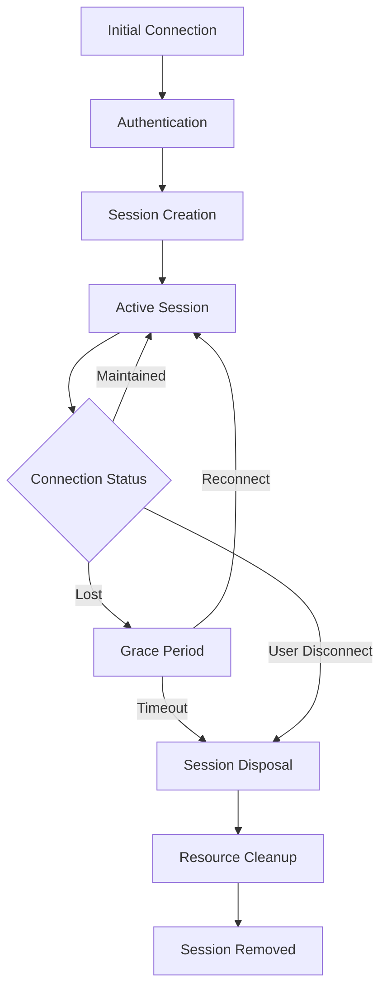

## Overview

User sessions in MentraOS Cloud follow a well-defined lifecycle from initial connection through active use, reconnection scenarios, and eventual cleanup. Understanding this lifecycle is crucial for proper resource management and user experience.

## Lifecycle Stages



## 1. Initial Connection

### WebSocket Upgrade

When glasses connect to `/glasses-ws`:

```typescript
// In WebSocketService
if (url.pathname === '/glasses-ws') {
  // Extract and verify JWT token
  const coreToken = request.headers.authorization?.split(' ')[1];
  const userData = jwt.verify(coreToken, AUGMENTOS_AUTH_JWT_SECRET);
  const userId = userData.email;
  
  // Attach userId to request
  (request as any).userId = userId;
  
  // Proceed with WebSocket upgrade
  this.glassesWss.handleUpgrade(request, socket, head, ws => {
    this.glassesWss.emit('connection', ws, request);
  });
}
```

### Authentication Validation

The JWT token must contain:
- `email`: User's email address (used as userId)
- `sub`: Subject identifier
- Valid signature with `AUGMENTOS_AUTH_JWT_SECRET`

## 2. Session Creation

### New Session

When no existing session exists:

```typescript
// In SessionService
const userSession = new UserSession(userId, ws);

// Initialize with installed apps
const installedApps = await appService.getAllApps(userId);
for (const app of installedApps) {
  userSession.installedApps.set(app.packageName, app);
}

return { userSession, reconnection: false };
```

### Reconnection

When user reconnects to existing session:

```typescript
const existingSession = UserSession.getById(userId);

if (existingSession) {
  // Update WebSocket and cancel cleanup
  existingSession.updateWebSocket(ws);
  existingSession.disconnectedAt = null;
  
  if (existingSession.cleanupTimerId) {
    clearTimeout(existingSession.cleanupTimerId);
    existingSession.cleanupTimerId = undefined;
  }
  
  return { userSession: existingSession, reconnection: true };
}
```

## 3. Active Session State

### Manager Initialization

Each UserSession initializes specialized managers:

```typescript
constructor(userId: string, websocket: WebSocket) {
  // Core identification
  this.userId = userId;
  this.websocket = websocket;
  
  // Initialize managers
  this.appManager = new AppManager(this);
  this.audioManager = new AudioManager(this);
  this.displayManager = new DisplayManager(this);
  this.transcriptionManager = new TranscriptionManager(this);
  // ... other managers
  
  // Start heartbeat
  this.setupGlassesHeartbeat();
  
  // Register in storage
  SessionStorage.getInstance().set(userId, this);
}
```

### Heartbeat Monitoring

Maintains connection health:

```typescript
private setupGlassesHeartbeat(): void {
  const HEARTBEAT_INTERVAL = 10000; // 10 seconds
  
  this.glassesHeartbeatInterval = setInterval(() => {
    if (this.websocket.readyState === WebSocket.OPEN) {
      this.websocket.ping();
    } else {
      this.clearGlassesHeartbeat();
    }
  }, HEARTBEAT_INTERVAL);
}
```

### Connection Acknowledgment

Send initial connection success:

```typescript
// In GlassesWebSocketService (websocket-glasses.service.ts:558-566)
const connectionAck = {
  type: CloudToGlassesMessageType.CONNECTION_ACK,
  sessionId: userSession.sessionId,
  userSession: await sessionService.transformUserSessionForClient(userSession),
  timestamp: new Date()
};

ws.send(JSON.stringify(connectionAck));
```

## 4. Disconnection Handling

### Grace Period

When connection is lost:

```typescript
// In GlassesWebSocketService handleDisconnect
userSession.disconnectedAt = new Date();

// Set cleanup timer (5 minutes default)
const CLEANUP_TIMEOUT = 5 * 60 * 1000;

userSession.cleanupTimerId = setTimeout(async () => {
  logger.info(`Cleaning up session for user ${userId} after grace period`);
  
  // Stop all running apps
  for (const packageName of userSession.runningApps) {
    await userSession.appManager.stopApp(packageName);
  }
  
  // Dispose session
  await userSession.dispose();
}, CLEANUP_TIMEOUT);
```

### Reconnection During Grace Period

If user reconnects within grace period:

1. **Cancel cleanup timer**
2. **Update WebSocket connection**
3. **Clear disconnection timestamp**
4. **Resume normal operation**
5. **No app restarts needed**

## 5. Session Disposal

### Trigger Conditions

Sessions are disposed when:
- Grace period expires after disconnection
- Server shutdown
- Manual cleanup request
- Fatal errors

### Disposal Process

```typescript
async dispose(): Promise<void> {
  // Track session metrics
  const duration = Date.now() - this.startTime.getTime();
  await PosthogService.trackEvent("disconnected", this.userId, {
    duration,
    disconnectedAt: new Date().toISOString()
  });
  
  // Dispose all managers
  if (this.appManager) this.appManager.dispose();
  if (this.audioManager) this.audioManager.dispose();
  if (this.microphoneManager) this.microphoneManager.dispose();
  // ... dispose all managers
  
  // Clear heartbeat
  this.clearGlassesHeartbeat();
  
  // Clear timers
  if (this.cleanupTimerId) {
    clearTimeout(this.cleanupTimerId);
  }
  
  // Remove from storage
  SessionStorage.getInstance().delete(this.userId);
  
  // Clean up subscriptions
  subscriptionService.removeAllSubscriptionsForSession(this.userId);
}
```

## 6. Resource Cleanup

### Manager Disposal

Each manager cleans up its resources:

```typescript
// Example: AudioManager disposal
dispose(): void {
  // Clear intervals
  if (this.bufferCleanupInterval) {
    clearInterval(this.bufferCleanupInterval);
  }
  
  // Clear buffers
  this.bufferedAudio = [];
  this.recentAudioBuffer = [];
  
  // Remove event listeners
  this.removeAllListeners();
}
```

### Subscription Cleanup

Remove all app subscriptions:

```typescript
// In SubscriptionService
removeAllSubscriptionsForSession(sessionId: string): void {
  for (const key of this.subscriptions.keys()) {
    if (key.startsWith(`${sessionId}:`)) {
      this.subscriptions.delete(key);
    }
  }
  
  // Clear caches
  this.calendarEventsCache.delete(sessionId);
  this.lastLocationCache.delete(sessionId);
}
```

## Session State Tracking

### Connection States

```typescript
enum SessionState {
  CONNECTING,      // Initial connection
  ACTIVE,         // Normal operation
  DISCONNECTED,   // Connection lost, grace period
  DISPOSING,      // Being cleaned up
  DISPOSED        // Fully removed
}
```

### Metrics Collection

Sessions track:
- **Connection duration**: Total time connected
- **Reconnection count**: Number of reconnections
- **Active apps**: Apps used during session
- **Data processed**: Audio, transcripts, etc.

## Best Practices

1. **Always handle reconnections gracefully** - Preserve state when possible
2. **Set appropriate grace periods** - Balance resource usage vs user experience
3. **Clean up all resources** - Prevent memory leaks
4. **Track metrics** - Monitor session health and patterns
5. **Log lifecycle events** - Aid debugging and monitoring
6. **Handle edge cases** - Concurrent connections, rapid reconnects

## Error Handling

### Connection Errors

```typescript
// Send error before closing
userSession.sendError(
  "Authentication failed", 
  GlassesErrorCode.AUTHENTICATION_FAILED
);

// Clean close
ws.close(1008, "Authentication failed");
```

### Disposal Errors

Always attempt full cleanup even if individual components fail:

```typescript
try {
  await manager.dispose();
} catch (error) {
  logger.error(`Failed to dispose manager: ${error}`);
  // Continue with other disposals
}
```

## Related Documentation

- **[UserSession Class](/cloud-architecture/session-management/user-session-class)**: Core session implementation
- **[SessionService](/cloud-architecture/services/session-service)**: Session management service
- **[WebSocketService](/cloud-architecture/services/websocket-service)**: Connection handling
- **[Manager Overview](/cloud-architecture/managers/overview)**: Manager lifecycle