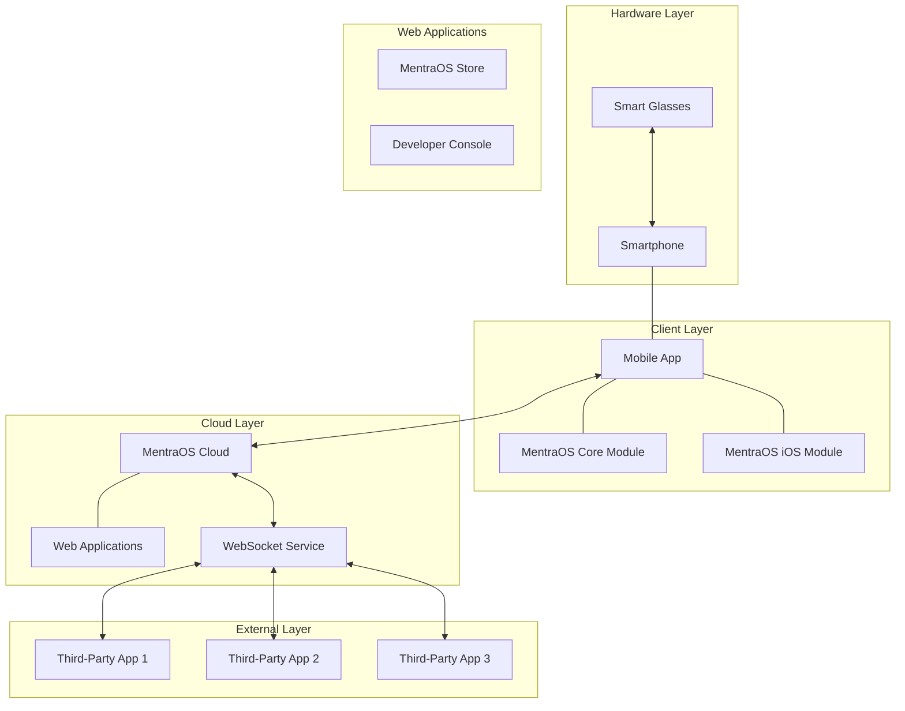
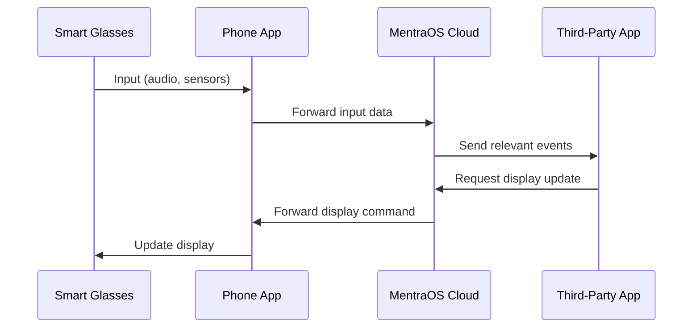

# Contributing to MentraOS

Thank you for your interest in contributing to MentraOS! This guide will help you understand the project architecture, development workflow, and how to make effective contributions.

## Project Overview

MentraOS is an open-source operating system, app store, and development framework for smart glasses. The system follows a distributed architecture where most processing happens in the cloud, with the glasses primarily acting as input/output devices.

### Core Components



### System Components

1. **Mobile App** (`mobile/`):
   - React Native application for smartphones
   - User interface for managing glasses, apps, and settings
   - Interfaces with native modules on iOS/Android

2. **Android Core** (`android_core/`):
   - Android native module
   - Handles Bluetooth communication with glasses
   - Handles phone/glasses microphone management
   - Handles websocket communications with the cloud
   - Manages glass connections and capabilities

3. **iOS Native Module** (`mobile/ios`):
   - iOS native module
   - Handles Bluetooth communication with glasses
   - Handles phone/glasses microphone management
   - Handles websocket communications with the cloud
   - Manages glass connections and capabilities

4. **Android Smart Glasses Client** (`asg_client/`):
   - Android code that runs on Android-based smart glasses
   - Enables glasses to connect to the MentraOS ecosystem
   - Provides a BLE API for Android-based glasses to connect to the MentraOS Mobile App
   - Can communicate with MentraOS Cloud directly for streaming photos/videos, falls back to BLE for photos when internet is not available

5. **MentraOS Cloud** (`cloud/`):
   - Node.js backend services
   - Manages app sessions, transcription, display, audio playback
   - Handles real-time communication between glasses and apps
   - Controls app lifecycle and display rendering

6. **Mentra Store** (`cloud/store/`):
   - React application for users to discover and install apps
   - Showcases available apps
   - Provides app descriptions (and in the future: screenshots + ratings)
   - Handles app installation

7. **MentraOS Developer Console** (`cloud/developer-portal/`):
   - React application for developers to register and manage apps
   - Provides tools for app submission and updates
   - Includes documentation and SDK resources

8. **MentraOS Apps**:
   - External web servers that connect to MentraOS cloud
   - Use webhooks and websockets for real-time communication
   - Leverage Mentra SDK for display and input handling

## Data Flow



## Third-Party App Architecture

Third-party apps in the MentraOS ecosystem follow a specific pattern:

1. **Webhook Endpoint** - Entry point for starting an app session
2. **WebSocket Connection** - Real-time communication channel
3. **Event Subscriptions** - Listen for specific user events
4. **Display Requests** - Send content to be displayed on glasses

## Development Environment Setup

### Prerequisites

- Node.js and npm/yarn/bun
- Android Studio (for Android development)
- Xcode (for iOS development)
- Docker and Docker Compose (for cloud development)

### Project Links

- [GitHub Project Board for General Tasks](https://github.com/orgs/Mentra-Community/projects/2)
- [All GitHub Projects](https://github.com/Mentra-Community/MentraOS/projects?query=is%3Aopen)

### Setting Up the Manager App

```bash
# Clone the repository
git clone https://github.com/Mentra-Community/MentraOS.git
cd MentraOS/mobile

# Install dependencies
npm install

# For iOS
cd ios && pod install && cd ..

# Start the development server
npm start

# Run on Android/iOS
npm run android
# or
npm run ios
```

### Setting Up the Cloud Backend

```bash
cd MentraOS/mentraos_cloud

# Install dependencies
bun install

# Setup Docker network
bun run dev:setup-network

# Start development environment
./scripts/docker-setup.sh
# or
bun run setup-deps
bun run dev
```

### Build Commands

#### React Native

```bash
# Start the development server
npm start

# Build and run on Android/iOS
npm run android
npm run ios

# Build Android packages
npm run build-android
npm run build-android-release

# Run tests
npm test
npm test -- -t "test name"  # Run a single test

# Lint code
npm run lint
```

## Contribution Workflow

1. **Fork the Repository**: Create your own fork of the MentraOS repository.
2. **Create a Branch**: Make your changes in a new branch.
3. **Develop and Test**: Make your changes and test thoroughly.
4. **Submit a Pull Request**: Create a PR with a clear description of your changes.

### Component-Specific Guidelines

Different components of MentraOS have their own coding standards:

- **[Mobile App Guidelines](/contributing/mentraos-manager-guidelines)** - React Native mobile app development standards
- **MentraOS Cloud Guidelines** - Backend service development (coming soon)
- **SDK Development Guidelines** - Third-party app development (coming soon)

### Code Style

- For TypeScript/JavaScript: Follow ESLint configurations
- For Java: Follow Android code style guidelines
- For Swift: Follow Swift style guide

## Documentation

- Update relevant documentation when adding new features
- Include code comments for complex logic
- Create or update API documentation as needed

## Testing

- Write unit tests for new features
- Ensure your changes pass existing tests
- Test on actual devices when possible

## Communication

- Join our [Discord community](https://mentra.glass/discord)
- Report issues on GitHub
- Discuss major changes in advance

## Where to Start

### Good First Issues

- Documentation improvements
- Bug fixes
- UI enhancements
- Test improvements

### Key Areas for Contribution

1. **Display Rendering**: Improve UI components and layouts
2. **Glasses Support**: Add support for new smart glasses models
3. **SDK Enhancements**: Improve developer experience
4. **Performance Optimization**: Reduce latency and improve efficiency

## License

By contributing to MentraOS, you agree that your contributions will be licensed under the MIT License, which is the project's license. The full license text can be found [here](https://github.com/Mentra-Community/MentraOS/blob/main/LICENSE).
